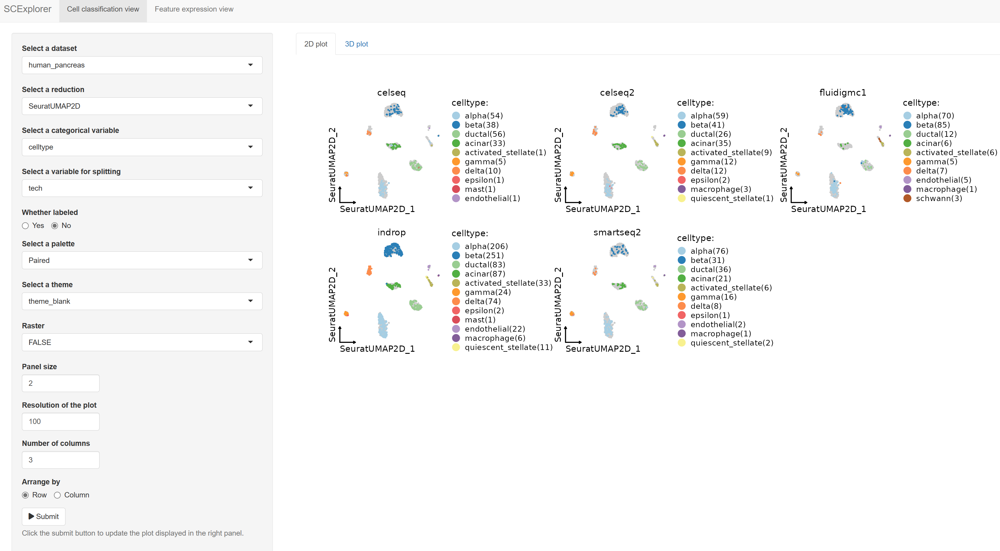
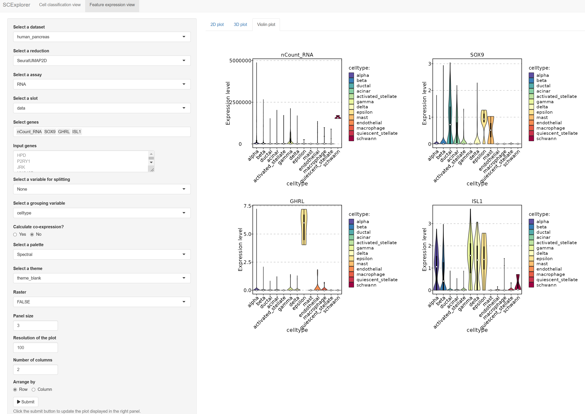
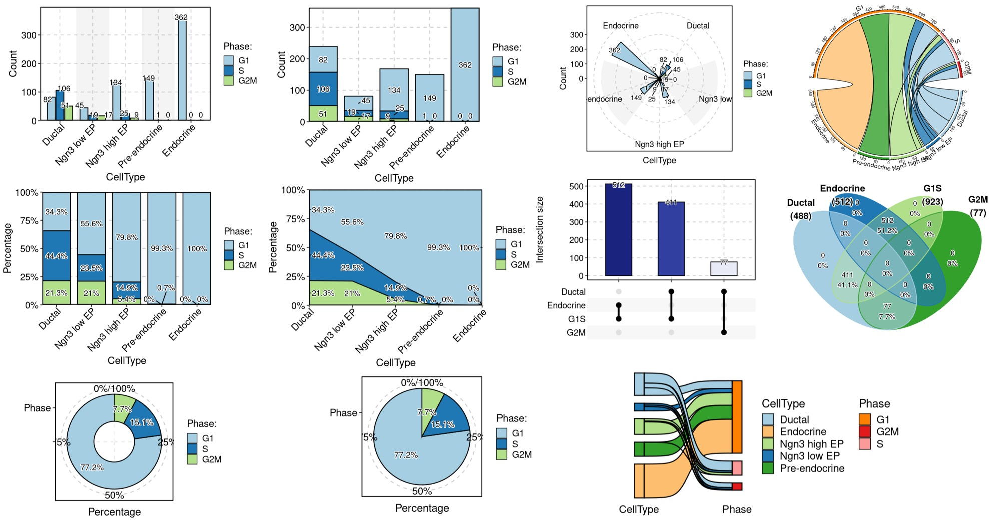
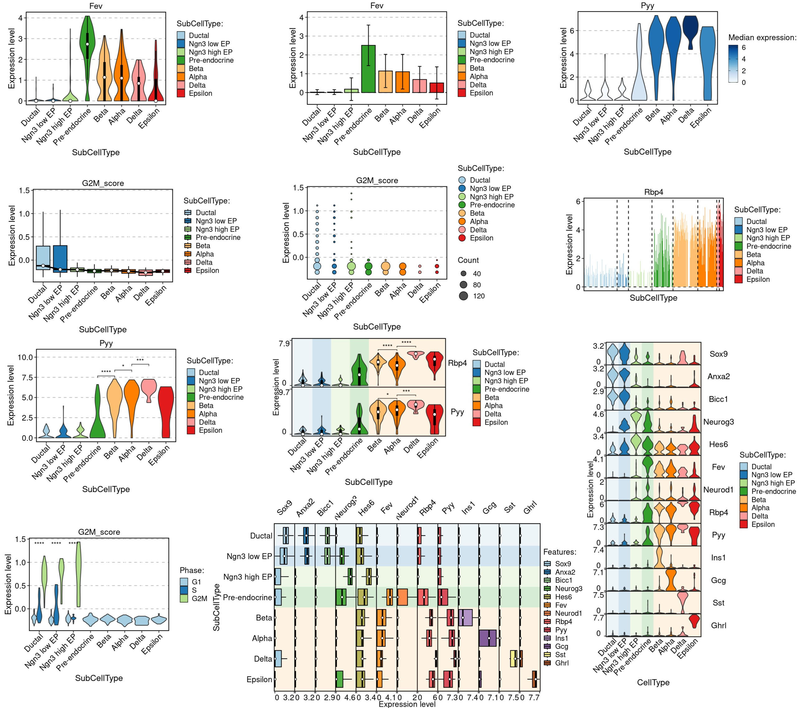
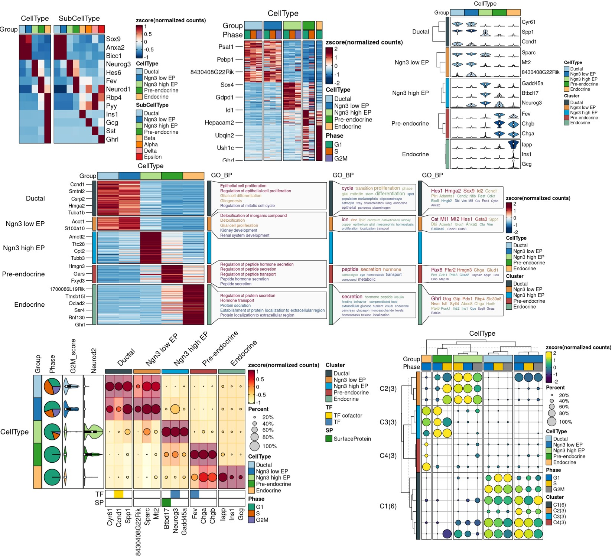

```{r opts, include = FALSE}
knitr::opts_chunk$set(
  cache = FALSE,
  collapse = TRUE,
  tidy = FALSE,
  comment = "#>",
  results = "hide",
  message = FALSE,
  warning = FALSE,
  fig.path = "README/README-",
  fig.height = 5,
  fig.width = 10,
  fig.align = "center",
  dpi = 300,
  out.width = "100%"
)
```

# SCP: Single Cell Pipeline

<!-- badges: start -->

[](https://github.com/zhanghao-njmu/SCP) [](https://github.com/zhanghao-njmu/SCP) [](https://github.com/zhanghao-njmu/SCP)

<!-- badges: end -->

SCP provides a comprehensive set of tools for single cell data processing and downstream analysis.

The package includes the following facilities:

-   Integrated single cell quality control methods.
-   Pipelines embedded with multiple methods for normalization, feature reduction, and cell population identification (standard Seurat workflow).
-   Pipelines embedded with multiple integration methods for scRNA-seq or scATAC-seq data, including Uncorrected, [Seurat](https://github.com/satijalab/seurat), [scVI](https://github.com/scverse/scvi-tools), [MNN](http://www.bioconductor.org/packages/release/bioc/html/batchelor.html), [fastMNN](http://www.bioconductor.org/packages/release/bioc/html/batchelor.html), [Harmony](https://github.com/immunogenomics/harmony), [Scanorama](https://github.com/brianhie/scanorama), [BBKNN](https://github.com/Teichlab/bbknn), [CSS](https://github.com/quadbiolab/simspec), [LIGER](https://github.com/welch-lab/liger), [Conos](https://github.com/kharchenkolab/conos), [ComBat](https://bioconductor.org/packages/release/bioc/html/sva.html).
-   Multiple single cell downstream analyses such as identification of differential features, enrichment analysis, GSEA analysis, identification of dynamic features, [PAGA](https://github.com/theislab/paga), [RNA velocity](https://github.com/theislab/scvelo), [Palantir](https://github.com/dpeerlab/Palantir), [Monocle2](http://cole-trapnell-lab.github.io/monocle-release), [Monocle3](https://cole-trapnell-lab.github.io/monocle3), etc.
-   Multiple methods for automatic annotation of single-cell data and methods for projection between single-cell datasets.
-   High quality data visualization methods.
-   Fast deployment of single-cell data into SCExplorer, a [shiny app](https://shiny.rstudio.com/) that provides an interactive visualization interface.

The functions in the SCP package are all developed around the [Seurat object](https://github.com/mojaveazure/seurat-object) and compatible with other Seurat functions.

## R version requirement

-   R \>= 4.1.0

## Installation in the global R environment

You can install the latest version of SCP from [GitHub](https://github.com/zhanghao-njmu/SCP) with:

```{r install, eval=FALSE}
if (!require("devtools", quietly = TRUE)) {
  install.packages("devtools")
}
devtools::install_github("zhanghao-njmu/SCP")
```

#### Create SCP python environment

To run functions such as `RunPAGA` or `RunSCVELO`, SCP requires [conda](https://docs.conda.io/en/latest/miniconda.html) to create a separate python environment. The default environment name is `"SCP_env"`. You can specify the environment name for SCP by setting `options(SCP_env_name="new_name")`

Now, you can run `PrepareEnv()` to create the python environment for SCP. If the conda binary is not found, it will automatically download and install miniconda.

```{r eval=FALSE}
SCP::PrepareEnv()
```

To force SCP to use a specific conda binary, it is recommended to set `reticulate.conda_binary` R option:

```{r eval=FALSE}
options(reticulate.conda_binary = "/path/to/conda")
SCP::PrepareEnv()
```

If the download of miniconda or pip packages is slow, you can specify the miniconda repo and PyPI mirror according to your network region.

```{r eval=FALSE}
SCP::PrepareEnv(
  miniconda_repo = "https://mirrors.bfsu.edu.cn/anaconda/miniconda",
  pip_options = "-i https://pypi.tuna.tsinghua.edu.cn/simple"
)
```

Available miniconda repositories:

-   <https://repo.anaconda.com/miniconda> (default)

-   <http://mirrors.aliyun.com/anaconda/miniconda>

-   <https://mirrors.bfsu.edu.cn/anaconda/miniconda>

-   <https://mirrors.pku.edu.cn/anaconda/miniconda>

-   <https://mirror.nju.edu.cn/anaconda/miniconda>

-   <https://mirrors.sustech.edu.cn/anaconda/miniconda>

-   <https://mirrors.xjtu.edu.cn/anaconda/miniconda>

-   <https://mirrors.hit.edu.cn/anaconda/miniconda>

Available PyPI mirrors:

-   <https://pypi.python.org/simple> (default)

-   <https://mirrors.aliyun.com/pypi/simple>

-   <https://pypi.tuna.tsinghua.edu.cn/simple>

-   <https://mirrors.pku.edu.cn/pypi/simple>

-   <https://mirror.nju.edu.cn/pypi/web/simple>

-   <https://mirrors.sustech.edu.cn/pypi/simple>

-   <https://mirrors.xjtu.edu.cn/pypi/simple>

-   <https://mirrors.hit.edu.cn/pypi/web/simple>

## Installation in a isolated R environment using renv

If there are some R package version conflicts, or you do not want to change your current R environment, you can use the [renv](https://rstudio.github.io/renv/) package to install SCP into an isolated R environment.

#### Create a isolated R environment

```{r eval=FALSE}
if (!require("renv", quietly = TRUE)) {
  install.packages("renv")
}
dir.create("~/SCP_env", recursive = TRUE) # It cannot be the home directory "~" !
renv::init(project = "~/SCP_env", bare = TRUE, restart = TRUE)
```

#### Install SCP package and create SCP python environment

```{r eval=FALSE}
renv::activate(project = "~/SCP_env")
renv::install("BiocManager")
renv::install("zhanghao-njmu/SCP", repos = BiocManager::repositories())
SCP::PrepareEnv()
```

When installing packages, network issues may cause the download to fail. Sometimes you need to provide a GitHub personal access token and restart the r session before downloading.

#### Activate SCP environment first before use

```{r eval=FALSE}
renv::activate(project = "~/SCP_env")

library(SCP)
data("pancreas_sub")
pancreas_sub <- RunPAGA(srt = pancreas_sub, group_by = "SubCellType", linear_reduction = "PCA", nonlinear_reduction = "UMAP")
CellDimPlot(pancreas_sub, group.by = "SubCellType", reduction = "draw_graph_fr")
```

#### Save and restore the state of SCP environment

```{r eval=FALSE}
renv::snapshot(project = "~/SCP_env")
renv::restore(project = "~/SCP_env")
```

## Examples

-   [Load the Data]

-   [CellQC]

-   [Standard pipeline]

-   [Integration pipeline]

-   [Cell projection between single-cell datasets]

-   [Cell annotation using bulk RNA-seq datasets]

-   [Cell annotation using single-cell datasets]

-   [PAGA analysis]

-   [Velocity analysis]

-   [Differential expression analysis]

-   [Enrichment analysis(over-representation)]

-   [Enrichment analysis(GSEA)]

-   [Trajectory inference]

-   [Dynamic features]

-   [Interactive data visualization with SCExplorer]

-   [Other visualization examples]

### Load the Data

The analysis is based on a subsetted version of [mouse pancreas data](https://doi.org/10.1242/dev.173849).

```{r library,results='markup'}
library(SCP)
data("pancreas_sub")
print(pancreas_sub)
```

Data exploration:

```{r EDA}
CellDimPlot(
  srt = pancreas_sub, group.by = c("CellType", "SubCellType"),
  reduction = "UMAP", theme_use = "theme_blank"
)
CellDimPlot(
  srt = pancreas_sub, group.by = "SubCellType", stat.by = "Phase",
  reduction = "UMAP", theme_use = "theme_blank"
)
FeatureDimPlot(
  srt = pancreas_sub, features = c("Sox9", "Neurog3", "Fev", "Rbp4"),
  reduction = "UMAP", theme_use = "theme_blank"
)
FeatureDimPlot(
  srt = pancreas_sub, features = c("Ins1", "Gcg", "Sst", "Ghrl"),
  compare_features = TRUE, label = TRUE, label_insitu = TRUE,
  reduction = "UMAP", theme_use = "theme_blank"
)
ht <- GroupHeatmap(
  srt = pancreas_sub,
  features = c(
    "Sox9", "Anxa2", # Ductal
    "Neurog3", "Hes6", # EPs
    "Fev", "Neurod1", # Pre-endocrine
    "Rbp4", "Pyy", # Endocrine
    "Ins1", "Gcg", "Sst", "Ghrl" # Beta, Alpha, Delta, Epsilon
  ),
  group.by = c("CellType", "SubCellType"),
  heatmap_palette = "YlOrRd",
  cell_annotation = c("Phase", "G2M_score", "Cdh2"),
  cell_annotation_palette = c("Dark2", "Paired", "Paired"),
  show_row_names = TRUE, row_names_side = "left",
  add_dot = TRUE, add_reticle = TRUE
)
print(ht$plot)
```

### CellQC

```{r RunCellQC}
pancreas_sub <- RunCellQC(srt = pancreas_sub)
CellDimPlot(srt = pancreas_sub, group.by = "CellQC", reduction = "UMAP")
CellStatPlot(srt = pancreas_sub, stat.by = "CellQC", group.by = "CellType", label = TRUE)
CellStatPlot(
  srt = pancreas_sub,
  stat.by = c(
    "db_qc", "outlier_qc", "umi_qc", "gene_qc",
    "mito_qc", "ribo_qc", "ribo_mito_ratio_qc", "species_qc"
  ),
  plot_type = "upset", stat_level = "Fail"
)
```

### Standard pipeline

```{r Standard_SCP}
pancreas_sub <- Standard_SCP(srt = pancreas_sub)
CellDimPlot(
  srt = pancreas_sub, group.by = c("CellType", "SubCellType"),
  reduction = "StandardUMAP2D", theme_use = "theme_blank"
)
```

```{r CellDimPlot3D,eval=FALSE}
CellDimPlot3D(srt = pancreas_sub, group.by = "SubCellType")
```


```{r FeatureDimPlot3D,eval=FALSE}
FeatureDimPlot3D(srt = pancreas_sub, features = c("Sox9", "Neurog3", "Fev", "Rbp4"))
```


### Integration pipeline

Example data for integration is a subsetted version of [panc8(eight human pancreas datasets)](https://github.com/satijalab/seurat-data)

```{r Integration_SCP}
data("panc8_sub")
panc8_sub <- Integration_SCP(srtMerge = panc8_sub, batch = "tech", integration_method = "Seurat")
CellDimPlot(
  srt = panc8_sub, group.by = c("celltype", "tech"), reduction = "SeuratUMAP2D",
  title = "Seurat", theme_use = "theme_blank"
)
```

UMAP embeddings based on different integration methods in SCP:

```{r Integration-all, echo=FALSE, fig.height=13.5, fig.width=8.5,eval=FALSE}
library(ggplot2)
library(cowplot)
library(gtable)
integration_methods <- c("Uncorrected", "Seurat", "scVI", "MNN", "fastMNN", "Harmony", "Scanorama", "BBKNN", "CSS", "LIGER", "Conos", "ComBat")
plist <- list()

for (method in integration_methods) {
  panc8_sub <- Integration_SCP(
    srtMerge = panc8_sub, batch = "tech",
    integration_method = method, nonlinear_reduction = "umap"
  )
  plist[[method]] <- CellDimPlot(panc8_sub,
    title = method, group.by = c("celltype"), reduction = paste0(method, "UMAP2D"), theme_use = "theme_blank",
    show_stat = F, xlab = "UMAP_1", ylab = "UMAP_2", legend.position = "none"
  )
}
p <- plot_grid(plotlist = plist, ncol = 3)
grob <- ggplotGrob(p)
legend <- get_legend(CellDimPlot(panc8_sub, group.by = c("celltype"), reduction = paste0(method, "UMAP2D"), theme_use = "theme_blank", legend.position = "bottom", legend.direction = "horizontal"))
grob <- gtable_add_rows(grob, sum(legend$heights) + unit(1, "cm"), 0)
grob <- gtable_add_grob(grob, legend, t = 1, l = min(grob$layout[grepl(pattern = "panel", x = grob$layout$name), "l"]))
panel_fix(grob, height = 2)
```


### Cell projection between single-cell datasets

```{r RunKNNMap}
panc8_rename <- RenameFeatures(srt = panc8_sub, newnames = make.unique(capitalize(rownames(panc8_sub), force_tolower = TRUE)), assays = "RNA")
srt_query <- RunKNNMap(srt_query = pancreas_sub, srt_ref = panc8_rename, ref_umap = "SeuratUMAP2D")
ProjectionPlot(
  srt_query = srt_query, srt_ref = panc8_rename,
  query_group = "SubCellType", ref_group = "celltype"
)
```

### Cell annotation using bulk RNA-seq datasets

```{r RunKNNPredict-bulk}
data("ref_scMCA")
pancreas_sub <- RunKNNPredict(srt_query = pancreas_sub, bulk_ref = ref_scMCA, filter_lowfreq = 20)
CellDimPlot(srt = pancreas_sub, group.by = "KNNPredict_classification", reduction = "UMAP", label = TRUE)
```

### Cell annotation using single-cell datasets

```{r RunKNNPredict-scrna}
pancreas_sub <- RunKNNPredict(
  srt_query = pancreas_sub, srt_ref = panc8_rename,
  ref_group = "celltype", filter_lowfreq = 20
)
CellDimPlot(srt = pancreas_sub, group.by = "KNNPredict_classification", reduction = "UMAP", label = TRUE)

pancreas_sub <- RunKNNPredict(
  srt_query = pancreas_sub, srt_ref = panc8_rename,
  query_group = "SubCellType", ref_group = "celltype",
  return_full_distance_matrix = TRUE
)
CellDimPlot(srt = pancreas_sub, group.by = "KNNPredict_classification", reduction = "UMAP", label = TRUE)

ht <- CellCorHeatmap(
  srt_query = pancreas_sub, srt_ref = panc8_rename,
  query_group = "SubCellType", ref_group = "celltype",
  nlabel = 3, label_by = "row",
  show_row_names = TRUE, show_column_names = TRUE
)
print(ht$plot)
```

### PAGA analysis

```{r RunPAGA}
pancreas_sub <- RunPAGA(
  srt = pancreas_sub, group_by = "SubCellType",
  linear_reduction = "PCA", nonlinear_reduction = "UMAP"
)
PAGAPlot(srt = pancreas_sub, reduction = "UMAP", label = TRUE, label_insitu = TRUE, label_repel = TRUE)
```

### Velocity analysis

```{r RunSCVELO}
pancreas_sub <- RunSCVELO(
  srt = pancreas_sub, group_by = "SubCellType",
  linear_reduction = "PCA", nonlinear_reduction = "UMAP"
)
VelocityPlot(srt = pancreas_sub, reduction = "UMAP", group_by = "SubCellType")
VelocityPlot(srt = pancreas_sub, reduction = "UMAP", plot_type = "stream")
```

### Differential expression analysis

```{r RunDEtest,fig.height=6, fig.width=12}
pancreas_sub <- RunDEtest(srt = pancreas_sub, group_by = "CellType", fc.threshold = 1, only.pos = FALSE)
VolcanoPlot(srt = pancreas_sub, group_by = "CellType")
```

```{r FeatureHeatmap, fig.height=6, fig.width=18}
DEGs <- pancreas_sub@tools$DEtest_CellType$AllMarkers_wilcox
DEGs <- DEGs[with(DEGs, avg_log2FC > 1 & p_val_adj < 0.05), ]
# Annotate features with transcription factors and surface proteins
pancreas_sub <- AnnotateFeatures(pancreas_sub, species = "Mus_musculus", db = c("TF", "SP"))
ht <- FeatureHeatmap(
  srt = pancreas_sub, group.by = "CellType", features = DEGs$gene, feature_split = DEGs$group1,
  species = "Mus_musculus", db = c("GO_BP", "KEGG", "WikiPathway"), anno_terms = TRUE,
  feature_annotation = c("TF", "SP"), feature_annotation_palcolor = list(c("gold", "steelblue"), c("forestgreen")),
  height = 5, width = 4
)
print(ht$plot)
```

### Enrichment analysis(over-representation) {#enrichment-analysisover-representation}

```{r RunEnrichment}
pancreas_sub <- RunEnrichment(
  srt = pancreas_sub, group_by = "CellType", db = "GO_BP", species = "Mus_musculus",
  DE_threshold = "avg_log2FC > 1 & p_val_adj < 0.05"
)
EnrichmentPlot(
  srt = pancreas_sub, group_by = "CellType", group_use = c("Ductal", "Endocrine"),
  plot_type = "bar"
)
EnrichmentPlot(
  srt = pancreas_sub, group_by = "CellType", group_use = c("Ductal", "Endocrine"),
  plot_type = "wordcloud"
)
EnrichmentPlot(
  srt = pancreas_sub, group_by = "CellType", group_use = c("Ductal", "Endocrine"),
  plot_type = "wordcloud", word_type = "feature"
)
```

```{r Enrichment_comparison, fig.height=6}
EnrichmentPlot(srt = pancreas_sub, group_by = "CellType", plot_type = "comparison")
```

### Enrichment analysis(GSEA) {#enrichment-analysisgsea}

```{r RunGSEA}
pancreas_sub <- RunGSEA(
  srt = pancreas_sub, group_by = "CellType", db = "GO_BP", species = "Mus_musculus",
  DE_threshold = "p_val_adj < 0.05"
)
GSEAPlot(srt = pancreas_sub, group_by = "CellType", group_use = "Endocrine", geneSetID = "GO:0007186")
```

```{r GSEA_comparison, fig.height=6}
GSEAPlot(srt = pancreas_sub, group_by = "CellType", plot_type = "comparison")
```

### Trajectory inference

```{r RunSlingshot}
pancreas_sub <- RunSlingshot(srt = pancreas_sub, group.by = "SubCellType", reduction = "UMAP")
FeatureDimPlot(pancreas_sub, features = paste0("Lineage", 1:3), reduction = "UMAP", theme_use = "theme_blank")
CellDimPlot(pancreas_sub, group.by = "SubCellType", reduction = "UMAP", lineages = paste0("Lineage", 1:3), lineages_span = 0.1)
```

### Dynamic features

```{r DynamicHeatmap, fig.height=9, fig.width=19}
pancreas_sub <- RunDynamicFeatures(srt = pancreas_sub, lineages = c("Lineage1", "Lineage2"), n_candidates = 200)
ht <- DynamicHeatmap(
  srt = pancreas_sub, lineages = c("Lineage1", "Lineage2"),
  use_fitted = TRUE, n_split = 6, reverse_ht = "Lineage1",
  species = "Mus_musculus", db = "GO_BP", anno_terms = TRUE, anno_keys = TRUE, anno_features = TRUE,
  heatmap_palette = "viridis", cell_annotation = "SubCellType",
  separate_annotation = list("SubCellType", c("Nnat", "Irx1")), separate_annotation_palette = c("Paired", "Set1"),
  feature_annotation = c("TF", "SP"), feature_annotation_palcolor = list(c("gold", "steelblue"), c("forestgreen")),
  pseudotime_label = 25, pseudotime_label_color = "red",
  height = 5, width = 2
)
print(ht$plot)
```

```{r DynamicPlot}
DynamicPlot(
  srt = pancreas_sub, lineages = c("Lineage1", "Lineage2"), group.by = "SubCellType",
  features = c("Plk1", "Hes1", "Neurod2", "Ghrl", "Gcg", "Ins2"),
  compare_lineages = TRUE, compare_features = FALSE
)
```

```{r FeatureStatPlot, fig.height=6, fig.width=13}
FeatureStatPlot(
  srt = pancreas_sub, group.by = "SubCellType", bg.by = "CellType",
  stat.by = c("Sox9", "Neurod2", "Isl1", "Rbp4"), add_box = TRUE,
  comparisons = list(
    c("Ductal", "Ngn3 low EP"),
    c("Ngn3 high EP", "Pre-endocrine"),
    c("Alpha", "Beta")
  )
)
```

### Interactive data visualization with SCExplorer

```{r SCExplorer}
PrepareSCExplorer(list(mouse_pancreas = pancreas_sub, human_pancreas = panc8_sub), base_dir = "./SCExplorer")
app <- RunSCExplorer(base_dir = "./SCExplorer")
list.files("./SCExplorer") # This directory can be used as site directory for Shiny Server.

if (interactive()) {
  shiny::runApp(app)
}
```

 

### Other visualization examples

[**CellDimPlot**](https://zhanghao-njmu.github.io/SCP/reference/CellDimPlot.html) [**CellStatPlot**](https://zhanghao-njmu.github.io/SCP/reference/CellStatPlot.html) [**FeatureStatPlot**](https://zhanghao-njmu.github.io/SCP/reference/FeatureStatPlot.html) [**GroupHeatmap**](https://zhanghao-njmu.github.io/SCP/reference/GroupHeatmap.html)

You can also find more examples in the documentation of the function: [Integration_SCP](https://zhanghao-njmu.github.io/SCP/reference/Integration_SCP.html), [RunKNNMap](https://zhanghao-njmu.github.io/SCP/reference/RunKNNMap.html), [RunMonocle3](https://zhanghao-njmu.github.io/SCP/reference/RunMonocle3.html), [RunPalantir](https://zhanghao-njmu.github.io/SCP/reference/RunPalantir.html), etc.
