SCP readme
================
Hao Zhang

# SCP: Single Cell Pipeline

<!-- badges: start -->

[](https://github.com/zhanghao-njmu/SCP/actions)

<!-- badges: end -->

The SCP package provides a comprehensive set of tools for single cell
data processing and downstream analysis.

The package includes facilities for:

-   Integrated single cell quality control methods.
-   One-stop single-cell pipeline embedded with multiple methods for
    normalization, feature reduction, cell population identification.
-   One-stop single-cell pipeline embedded with multiple data
    integration methods
-   Multiple single cell downstream analyses such as differential
    feature identification, enrichment analysis, GSEA analysis, dynamic
    feature identification, PAGA, RNA velocity, etc.
-   Multiple methods for automatic annotation of single-cell data and
    projection methods between single-cell datasets.
-   Publication-quality visualization of multiple analysis results.
-   Fast deployment of single-cell data to shiny app.

The functions in the SCP package are all developed around the [Seurat
object](https://github.com/mojaveazure/seurat-object) and compatible
with other Seurat functions.

## Installation

You can install the development version of SCP from
[GitHub](https://github.com/zhanghao-njmu/SCP) with:

``` r
if (!require("devtools", quietly = TRUE)) {
  install.packages("devtools")
}
devtools::install_github("zhanghao-njmu/SCP")
```

## Example

**Load the Data**

The analysis is based on a subsetted version of [mouse pancreas
data](https://doi.org/10.1242/dev.173849).

``` r
library(SCP)
#> Registered S3 method overwritten by 'spatstat.geom':
#>   method     from
#>   print.boxx cli
#> Default python will be used by SCP. 
#> One can use Sys.setenv(SCP_PYTHON='/path/to/python') to specify the python version before library(SCP).
#> python path: /home/zhanghao/.virtualenvs/SCP/bin/python
#> ======================== SCP python config ========================
#> python:         /home/zhanghao/.virtualenvs/SCP/bin/python
#> libpython:      /usr/lib64/libpython3.8.so
#> pythonhome:     /home/zhanghao/.virtualenvs/SCP:/home/zhanghao/.virtualenvs/SCP
#> version:        3.8.8 (default, Aug 25 2021, 16:13:02)  [GCC 8.5.0 20210514 (Red Hat 8.5.0-3)]
#> numpy:          /home/zhanghao/.virtualenvs/SCP/lib/python3.8/site-packages/numpy
#> numpy_version:  1.21.4
#> umap:           /home/zhanghao/.virtualenvs/SCP/lib64/python3.8/site-packages/umap
#> 
#> NOTE: Python version was forced by RETICULATE_PYTHON
#> ===================================================================
data("pancreas1k")
```

**CellQC**:

``` r
pancreas1k <- RunCellQC(pancreas1k)
#> Run doublet-calling with scDblFinder
#> Calculate outlier cells
#>      log10_nCount:lower:2.5       log10_nCount:higher:5 
#>                           0                           0 
#>    log10_nFeature:lower:2.5     log10_nFeature:higher:5 
#>                           5                           0 
#> featurecount_dist:lower:2.5 
#>                           8 
#> >>> Total cells: 1000 
#> >>> Cells which are filtered out: 25 
#> ... 13 potential doublets 
#> ... 12 outlier cells 
#> ... 0 low-UMI cells 
#> ... 0 low-gene cells 
#> ... 0 high-mito cells 
#> ... 0 high-ribo cells 
#> ... 0 low-ribo_mito_ratio cells 
#> ... 0 species-contaminated cells 
#> >>> Remained cells after filtering: 975
ClassDimPlot(pancreas1k, group.by = "CellQC", reduction = "UMAP")
```


``` r
ClassStatPlot(pancreas1k, stat.by = "CellQC", group.by = "CellType", label = TRUE)
```

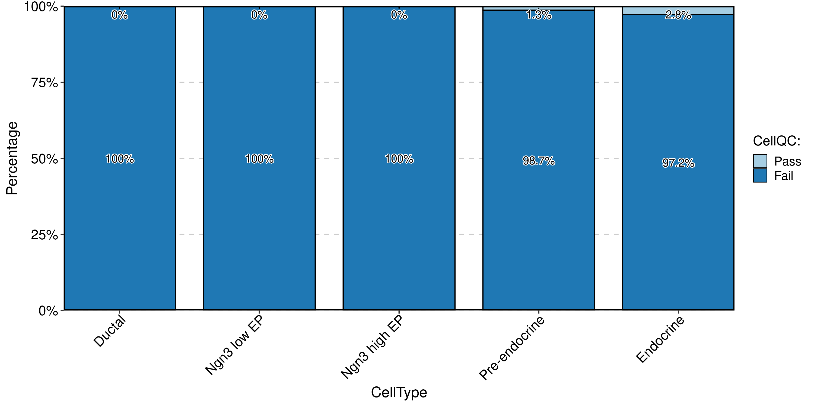

``` r
ClassStatPlot(pancreas1k, stat.by = c("db_qc", "outlier_qc", "umi_qc", "gene_qc", "mito_qc", "ribo_qc", "ribo_mito_ratio_qc", "species_qc"), plot_type = "upset")
#> Warning in ClassStatPlot(pancreas1k, stat.by = c("db_qc", "outlier_qc", :
#> 'stat.by' is a group of binary variables. Counting with the first level: 'Pass'
```

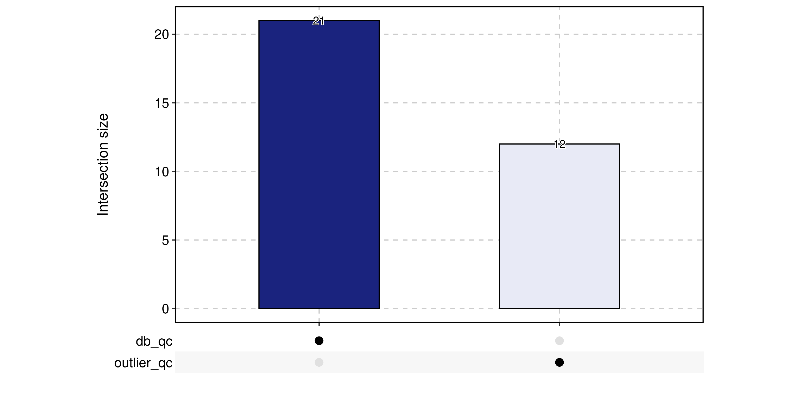

**Standard SCP**:

``` r
pancreas1k <- SCP::Standard_SCP(pancreas1k)
#> [2022-06-16 17:13:03] Start Standard_SCP
#> [2022-06-16 17:13:03] Checking srtList... ...
#> Data 1/1 of the srtList is raw counts. Perform NormalizeData(logCPM) on the data ...
#> Perform FindVariableFeatures on the data 1/1 of the srtList...
#> Use the separate HVF from the existed HVF in srtList...
#> [2022-06-16 17:13:05] Finished checking.
#> Perform ScaleData on the data...
#> Perform linear dimension reduction (pca) on the data...
#> Perform FindClusters (louvain) on the data...
#> Reorder clusters...
#> Perform nonlinear dimension reduction (umap) on the data...
#> [2022-06-16 17:13:43] Standard_SCP done
#> Elapsed time: 39.69 secs
ClassDimPlot(pancreas1k, group.by = "CellType", reduction = "StandardUMAP2D")
```

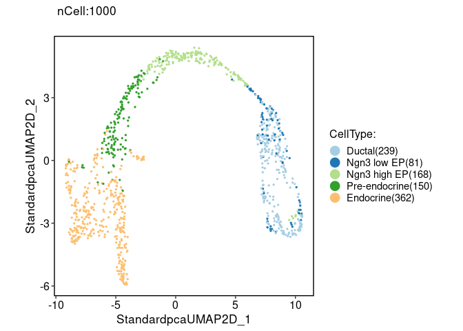

**Integration SCP**:

Example data for integration is [panc8(eight human pancreas
datasets)](https://github.com/satijalab/seurat-data)

``` r
if (!require("SeuratData", quietly = TRUE)) {
  devtools::install_github("satijalab/seurat-data")
}
#> ── Installed datasets ───────────────────────────────────── SeuratData v0.2.2 ──
#> ✓ panc8 3.0.2
#> ────────────────────────────────────── Key ─────────────────────────────────────
#> ✓ Dataset loaded successfully
#> > Dataset built with a newer version of Seurat than installed
#> ❓ Unknown version of Seurat installed
library(SeuratData)
suppressWarnings(InstallData("panc8"))
data("panc8")
panc8 <- Integration_SCP(panc8, batch = "tech", integration_method = "Seurat")
#> [2022-06-16 17:14:12] Start Seurat_integrate
#> [2022-06-16 17:14:17] Checking srtList... ...
#> Data 1/5 of the srtList is normalized without log transformation. Perform log1p on the data...
#> Perform FindVariableFeatures on the data 1/5 of the srtList...
#> Data 2/5 of the srtList is normalized without log transformation. Perform log1p on the data...
#> Perform FindVariableFeatures on the data 2/5 of the srtList...
#> Data 3/5 of the srtList is raw counts. Perform NormalizeData(logCPM) on the data ...
#> Perform FindVariableFeatures on the data 3/5 of the srtList...
#> Data 4/5 of the srtList is normalized without log transformation. Perform log1p on the data...
#> Perform FindVariableFeatures on the data 4/5 of the srtList...
#> Data 5/5 of the srtList is raw counts. Perform NormalizeData(logCPM) on the data ...
#> Perform FindVariableFeatures on the data 5/5 of the srtList...
#> Use the separate HVF from the existed HVF in srtList...
#> [2022-06-16 17:14:59] Finished checking.
#> Perform FindIntegrationAnchors on the data...
#> Perform integration(Seurat) on the data...
#> Perform ScaleData on the data...
#> Perform linear dimension reduction (pca) on the data...
#> Perform FindClusters (louvain) on the data...
#> Reorder clusters...
#> Perform nonlinear dimension reduction (umap) on the data...
#> [2022-06-16 17:26:23] Seurat_integrate done
#> Elapsed time: 12.18 mins
ClassDimPlot(panc8, group.by = c("celltype", "tech"), reduction = "SeuratUMAP2D", theme = "theme_blank")
```

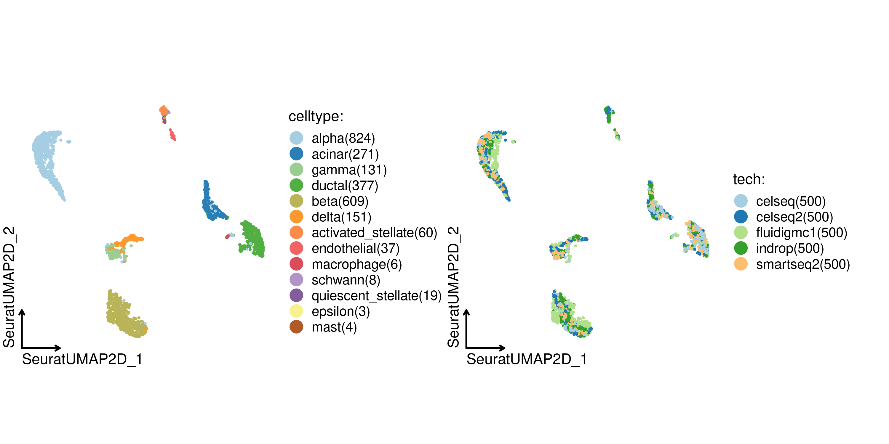

**Differential expression analysis**:

``` r
library(dplyr)
#> 
#> Attaching package: 'dplyr'
#> The following objects are masked from 'package:stats':
#> 
#>     filter, lag
#> The following objects are masked from 'package:base':
#> 
#>     intersect, setdiff, setequal, union
pancreas1k <- RunDEtest(pancreas1k, group_by = "CellType", only.pos = FALSE, fc.threshold = 1)
#> [2022-06-16 17:26:28] Start DEtest
#> Threads used for DE test: 124
#> Perform FindAllMarkers(wilcox)...
#>   |                                                                              |                                                                      |   0%  |                                                                              |==============                                                        |  20%  |                                                                              |============================                                          |  40%  |                                                                              |==========================================                            |  60%  |                                                                              |========================================================              |  80%  |                                                                              |======================================================================| 100%
#> 
#> [2022-06-16 17:30:19] DEtest done
#> Elapsed time: 3.84 mins
DEGs <- filter(pancreas1k@tools$DEtest_CellType$AllMarkers_wilcox, p_val_adj < 0.05 & avg_log2FC > 1)
ExpHeatmapPlot(pancreas1k, genes = DEGs$gene, gene_groups = DEGs$group1, cell_group_by = "CellType")
```

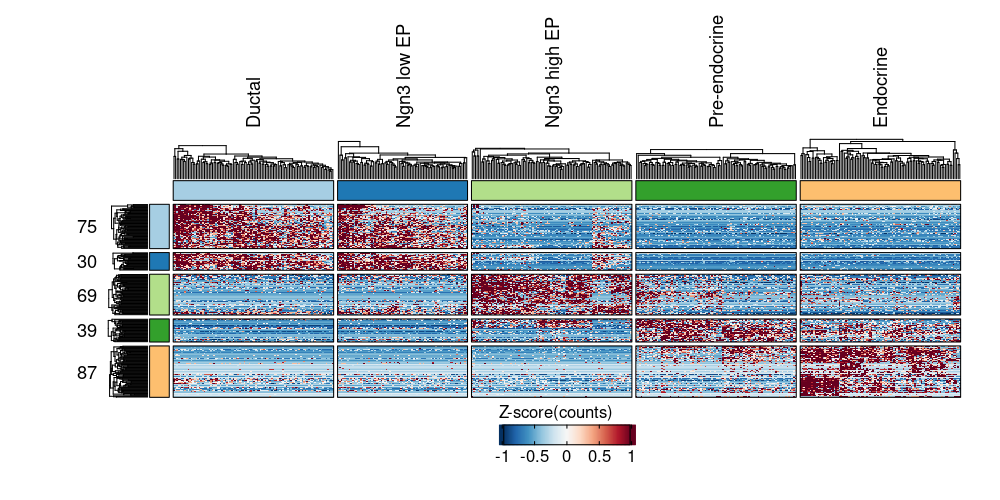

``` r
DEGs_top <- DEGs %>%
  group_by(gene) %>%
  top_n(1, avg_log2FC) %>%
  group_by(group1) %>%
  top_n(3, avg_log2FC)
ExpDotPlot(pancreas1k, genes = DEGs_top$gene, gene_groups = DEGs_top$group1, cell_group_by = "SubCellType")
```

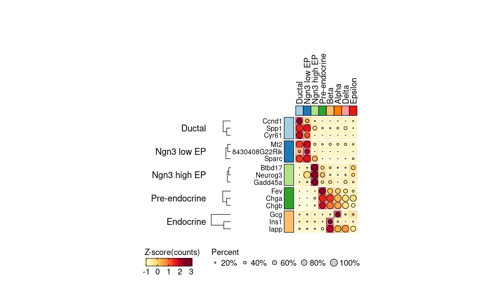

**Enrichment analysis(over-representation)**:

``` r
res <- RunEnrichment(geneID = DEGs$gene, geneID_groups = DEGs$group1, enrichment = "GO_BP", species = "Mus_musculus")
#> [2022-06-16 17:31:13] Start Enrichment
#> Species: Mus_musculus
#> Loaded cached db: GO_BP version:3.13.0 nterm:16027 created:2022-05-10 13:07:34
#> Permform enrichment...
#>   |                                                                              |                                                                      |   0%  |                                                                              |==============                                                        |  20%  |                                                                              |============================                                          |  40%  |                                                                              |==========================================                            |  60%  |                                                                              |========================================================              |  80%  |                                                                              |======================================================================| 100%
#> 
#> [2022-06-16 17:31:50] Enrichment done
#> Elapsed time: 37.72 secs
EnrichmentPlot(filter(res$enrichment, Groups %in% c("Ductal", "Endocrine")), plot_type = "bar", ncol = 1)
```

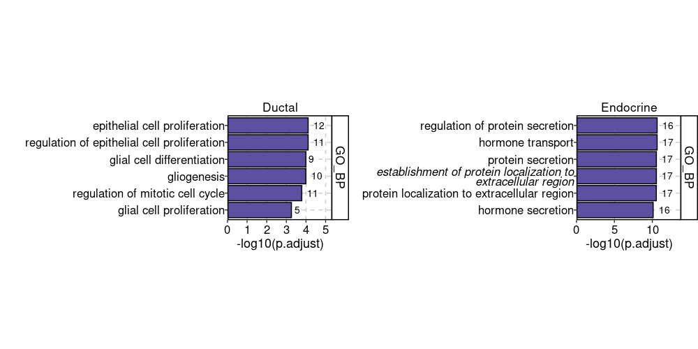

``` r
EnrichmentPlot(filter(res$enrichment, Groups %in% c("Ductal", "Endocrine")), plot_type = "wordcloud")
#> Some words could not fit on page. They have been removed.
#> Some words could not fit on page. They have been removed.
```

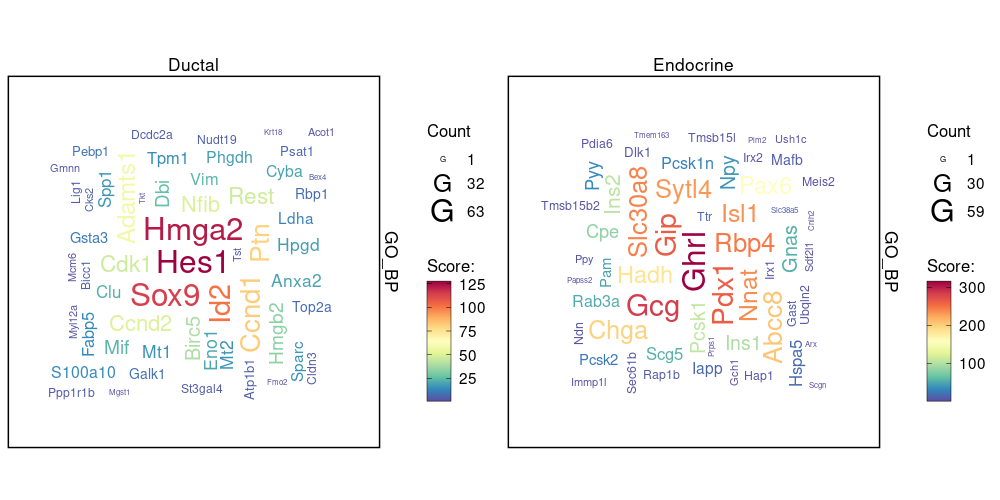

**Enrichment analysis(GSEA)**:

``` r
DEGs <- filter(pancreas1k@tools$DEtest_CellType$AllMarkers_wilcox, p_val_adj < 0.05)
res <- RunGSEA(geneID = DEGs$gene, geneScore = DEGs$avg_log2FC, geneID_groups = DEGs$group1, species = "Mus_musculus")
#> [2022-06-16 17:31:57] Start GSEA
#> Species: Mus_musculus
#> Loaded cached db: GO_BP version:3.13.0 nterm:16027 created:2022-05-10 13:07:34
#> Permform enrichment...
#>   |                                                                              |                                                                      |   0%  |                                                                              |==============                                                        |  20%
#>   |                                                                              |                                                                      |   0%  |                                                                              |=                                                                     |   1%  |                                                                              |=                                                                     |   2%  |                                                                              |==                                                                    |   3%  |                                                                              |===                                                                   |   4%  |                                                                              |===                                                                   |   5%  |                                                                              |====                                                                  |   5%  |                                                                              |====                                                                  |   6%  |                                                                              |=====                                                                 |   7%  |                                                                              |======                                                                |   8%  |                                                                              |======                                                                |   9%  |                                                                              |=======                                                               |  10%  |                                                                              |========                                                              |  11%  |                                                                              |========                                                              |  12%  |                                                                              |=========                                                             |  13%  |                                                                              |=========                                                             |  14%  |                                                                              |==========                                                            |  14%  |                                                                              |===========                                                           |  15%  |                                                                              |===========                                                           |  16%  |                                                                              |============                                                          |  17%  |                                                                              |=============                                                         |  18%  |                                                                              |=============                                                         |  19%  |                                                                              |==============                                                        |  20%  |                                                                              |===============                                                       |  21%  |                                                                              |===============                                                       |  22%  |                                                                              |================                                                      |  23%  |                                                                              |=================                                                     |  24%  |                                                                              |==================                                                    |  25%  |                                                                              |==================                                                    |  26%  |                                                                              |===================                                                   |  27%  |                                                                              |====================                                                  |  28%  |                                                                              |====================                                                  |  29%  |                                                                              |=====================                                                 |  30%  |                                                                              |=====================                                                 |  31%  |                                                                              |======================                                                |  32%  |                                                                              |=======================                                               |  32%  |                                                                              |=======================                                               |  33%  |                                                                              |========================                                              |  34%  |                                                                              |=========================                                             |  35%  |                                                                              |=========================                                             |  36%  |                                                                              |==========================                                            |  37%  |                                                                              |==========================                                            |  38%  |                                                                              |===========================                                           |  39%  |                                                                              |============================                                          |  40%  |                                                                              |============================                                          |  41%  |                                                                              |=============================                                         |  41%  |                                                                              |==============================                                        |  42%  |                                                                              |==============================                                        |  43%  |                                                                              |===============================                                       |  44%  |                                                                              |================================                                      |  45%  |                                                                              |================================                                      |  46%  |                                                                              |=================================                                     |  47%  |                                                                              |=================================                                     |  48%  |                                                                              |==================================                                    |  49%  |                                                                              |===================================                                   |  50%  |                                                                              |====================================                                  |  51%  |                                                                              |=====================================                                 |  52%  |                                                                              |=====================================                                 |  53%  |                                                                              |======================================                                |  54%  |                                                                              |======================================                                |  55%  |                                                                              |=======================================                               |  56%  |                                                                              |========================================                              |  57%  |                                                                              |========================================                              |  58%  |                                                                              |=========================================                             |  59%  |                                                                              |==========================================                            |  59%  |                                                                              |==========================================                            |  60%  |                                                                              |===========================================                           |  61%  |                                                                              |============================================                          |  62%  |                                                                              |============================================                          |  63%  |                                                                              |=============================================                         |  64%  |                                                                              |=============================================                         |  65%  |                                                                              |==============================================                        |  66%  |                                                                              |===============================================                       |  67%  |                                                                              |===============================================                       |  68%  |                                                                              |================================================                      |  68%  |                                                                              |=================================================                     |  69%  |                                                                              |=================================================                     |  70%  |                                                                              |==================================================                    |  71%  |                                                                              |==================================================                    |  72%  |                                                                              |===================================================                   |  73%  |                                                                              |====================================================                  |  74%  |                                                                              |====================================================                  |  75%  |                                                                              |=====================================================                 |  76%  |                                                                              |======================================================                |  77%  |                                                                              |=======================================================               |  78%  |                                                                              |=======================================================               |  79%  |                                                                              |========================================================              |  80%  |                                                                              |=========================================================             |  81%  |                                                                              |=========================================================             |  82%  |                                                                              |==========================================================            |  83%  |                                                                              |===========================================================           |  84%  |                                                                              |===========================================================           |  85%  |                                                                              |============================================================          |  86%  |                                                                              |=============================================================         |  86%  |                                                                              |=============================================================         |  87%  |                                                                              |==============================================================        |  88%  |                                                                              |==============================================================        |  89%  |                                                                              |===============================================================       |  90%  |                                                                              |================================================================      |  91%  |                                                                              |================================================================      |  92%  |                                                                              |=================================================================     |  93%  |                                                                              |==================================================================    |  94%  |                                                                              |==================================================================    |  95%  |                                                                              |===================================================================   |  95%  |                                                                              |===================================================================   |  96%  |                                                                              |====================================================================  |  97%  |                                                                              |===================================================================== |  98%  |                                                                              |===================================================================== |  99%  |                                                                              |======================================================================| 100%
#>   |                                                                              |============================                                          |  40%
#>   |                                                                              |                                                                      |   0%  |                                                                              |=                                                                     |   1%  |                                                                              |=                                                                     |   2%  |                                                                              |==                                                                    |   3%  |                                                                              |===                                                                   |   4%  |                                                                              |====                                                                  |   5%  |                                                                              |====                                                                  |   6%  |                                                                              |=====                                                                 |   7%  |                                                                              |=====                                                                 |   8%  |                                                                              |======                                                                |   9%  |                                                                              |=======                                                               |   9%  |                                                                              |=======                                                               |  10%  |                                                                              |========                                                              |  11%  |                                                                              |========                                                              |  12%  |                                                                              |=========                                                             |  13%  |                                                                              |==========                                                            |  14%  |                                                                              |==========                                                            |  15%  |                                                                              |===========                                                           |  15%  |                                                                              |===========                                                           |  16%  |                                                                              |============                                                          |  17%  |                                                                              |=============                                                         |  18%  |                                                                              |=============                                                         |  19%  |                                                                              |==============                                                        |  20%  |                                                                              |==============                                                        |  21%  |                                                                              |===============                                                       |  21%  |                                                                              |================                                                      |  22%  |                                                                              |================                                                      |  23%  |                                                                              |=================                                                     |  24%  |                                                                              |=================                                                     |  25%  |                                                                              |==================                                                    |  26%  |                                                                              |===================                                                   |  26%  |                                                                              |===================                                                   |  27%  |                                                                              |====================                                                  |  28%  |                                                                              |====================                                                  |  29%  |                                                                              |=====================                                                 |  30%  |                                                                              |======================                                                |  31%  |                                                                              |======================                                                |  32%  |                                                                              |=======================                                               |  32%  |                                                                              |=======================                                               |  33%  |                                                                              |========================                                              |  34%  |                                                                              |=========================                                             |  35%  |                                                                              |=========================                                             |  36%  |                                                                              |==========================                                            |  37%  |                                                                              |==========================                                            |  38%  |                                                                              |===========================                                           |  38%  |                                                                              |============================                                          |  39%  |                                                                              |============================                                          |  40%  |                                                                              |=============================                                         |  41%  |                                                                              |=============================                                         |  42%  |                                                                              |==============================                                        |  43%  |                                                                              |===============================                                       |  44%  |                                                                              |================================                                      |  45%  |                                                                              |================================                                      |  46%  |                                                                              |=================================                                     |  47%  |                                                                              |==================================                                    |  48%  |                                                                              |==================================                                    |  49%  |                                                                              |===================================                                   |  50%  |                                                                              |====================================                                  |  51%  |                                                                              |====================================                                  |  52%  |                                                                              |=====================================                                 |  53%  |                                                                              |======================================                                |  54%  |                                                                              |======================================                                |  55%  |                                                                              |=======================================                               |  56%  |                                                                              |========================================                              |  57%  |                                                                              |=========================================                             |  58%  |                                                                              |=========================================                             |  59%  |                                                                              |==========================================                            |  60%  |                                                                              |==========================================                            |  61%  |                                                                              |===========================================                           |  62%  |                                                                              |============================================                          |  62%  |                                                                              |============================================                          |  63%  |                                                                              |=============================================                         |  64%  |                                                                              |=============================================                         |  65%  |                                                                              |==============================================                        |  66%  |                                                                              |===============================================                       |  67%  |                                                                              |===============================================                       |  68%  |                                                                              |================================================                      |  68%  |                                                                              |================================================                      |  69%  |                                                                              |=================================================                     |  70%  |                                                                              |==================================================                    |  71%  |                                                                              |==================================================                    |  72%  |                                                                              |===================================================                   |  73%  |                                                                              |===================================================                   |  74%  |                                                                              |====================================================                  |  74%  |                                                                              |=====================================================                 |  75%  |                                                                              |=====================================================                 |  76%  |                                                                              |======================================================                |  77%  |                                                                              |======================================================                |  78%  |                                                                              |=======================================================               |  79%  |                                                                              |========================================================              |  79%  |                                                                              |========================================================              |  80%  |                                                                              |=========================================================             |  81%  |                                                                              |=========================================================             |  82%  |                                                                              |==========================================================            |  83%  |                                                                              |===========================================================           |  84%  |                                                                              |===========================================================           |  85%  |                                                                              |============================================================          |  85%  |                                                                              |============================================================          |  86%  |                                                                              |=============================================================         |  87%  |                                                                              |==============================================================        |  88%  |                                                                              |==============================================================        |  89%  |                                                                              |===============================================================       |  90%  |                                                                              |===============================================================       |  91%  |                                                                              |================================================================      |  91%  |                                                                              |=================================================================     |  92%  |                                                                              |=================================================================     |  93%  |                                                                              |==================================================================    |  94%  |                                                                              |==================================================================    |  95%  |                                                                              |===================================================================   |  96%  |                                                                              |====================================================================  |  97%  |                                                                              |===================================================================== |  98%  |                                                                              |===================================================================== |  99%  |                                                                              |======================================================================| 100%
#>   |                                                                              |==========================================                            |  60%
#>   |                                                                              |                                                                      |   0%  |                                                                              |=                                                                     |   1%  |                                                                              |=                                                                     |   2%  |                                                                              |==                                                                    |   3%  |                                                                              |===                                                                   |   4%  |                                                                              |===                                                                   |   5%  |                                                                              |====                                                                  |   6%  |                                                                              |=====                                                                 |   7%  |                                                                              |======                                                                |   8%  |                                                                              |======                                                                |   9%  |                                                                              |=======                                                               |  10%  |                                                                              |========                                                              |  11%  |                                                                              |========                                                              |  12%  |                                                                              |=========                                                             |  13%  |                                                                              |==========                                                            |  14%  |                                                                              |==========                                                            |  15%  |                                                                              |===========                                                           |  16%  |                                                                              |============                                                          |  17%  |                                                                              |=============                                                         |  18%  |                                                                              |=============                                                         |  19%  |                                                                              |==============                                                        |  20%  |                                                                              |===============                                                       |  21%  |                                                                              |===============                                                       |  22%  |                                                                              |================                                                      |  23%  |                                                                              |=================                                                     |  24%  |                                                                              |=================                                                     |  25%  |                                                                              |==================                                                    |  26%  |                                                                              |===================                                                   |  27%  |                                                                              |===================                                                   |  28%  |                                                                              |====================                                                  |  28%  |                                                                              |=====================                                                 |  29%  |                                                                              |=====================                                                 |  30%  |                                                                              |======================                                                |  31%  |                                                                              |======================                                                |  32%  |                                                                              |=======================                                               |  33%  |                                                                              |========================                                              |  34%  |                                                                              |========================                                              |  35%  |                                                                              |=========================                                             |  36%  |                                                                              |==========================                                            |  37%  |                                                                              |==========================                                            |  38%  |                                                                              |===========================                                           |  39%  |                                                                              |============================                                          |  39%  |                                                                              |============================                                          |  40%  |                                                                              |=============================                                         |  41%  |                                                                              |==============================                                        |  42%  |                                                                              |==============================                                        |  43%  |                                                                              |===============================                                       |  44%  |                                                                              |===============================                                       |  45%  |                                                                              |================================                                      |  46%  |                                                                              |=================================                                     |  47%  |                                                                              |=================================                                     |  48%  |                                                                              |==================================                                    |  49%  |                                                                              |===================================                                   |  50%  |                                                                              |====================================                                  |  51%  |                                                                              |=====================================                                 |  52%  |                                                                              |=====================================                                 |  53%  |                                                                              |======================================                                |  54%  |                                                                              |=======================================                               |  55%  |                                                                              |=======================================                               |  56%  |                                                                              |========================================                              |  57%  |                                                                              |========================================                              |  58%  |                                                                              |=========================================                             |  59%  |                                                                              |==========================================                            |  60%  |                                                                              |==========================================                            |  61%  |                                                                              |===========================================                           |  61%  |                                                                              |============================================                          |  62%  |                                                                              |============================================                          |  63%  |                                                                              |=============================================                         |  64%  |                                                                              |==============================================                        |  65%  |                                                                              |==============================================                        |  66%  |                                                                              |===============================================                       |  67%  |                                                                              |================================================                      |  68%  |                                                                              |================================================                      |  69%  |                                                                              |=================================================                     |  70%  |                                                                              |=================================================                     |  71%  |                                                                              |==================================================                    |  72%  |                                                                              |===================================================                   |  72%  |                                                                              |===================================================                   |  73%  |                                                                              |====================================================                  |  74%  |                                                                              |=====================================================                 |  75%  |                                                                              |=====================================================                 |  76%  |                                                                              |======================================================                |  77%  |                                                                              |=======================================================               |  78%  |                                                                              |=======================================================               |  79%  |                                                                              |========================================================              |  80%  |                                                                              |=========================================================             |  81%  |                                                                              |=========================================================             |  82%  |                                                                              |==========================================================            |  83%  |                                                                              |===========================================================           |  84%  |                                                                              |============================================================          |  85%  |                                                                              |============================================================          |  86%  |                                                                              |=============================================================         |  87%  |                                                                              |==============================================================        |  88%  |                                                                              |==============================================================        |  89%  |                                                                              |===============================================================       |  90%  |                                                                              |================================================================      |  91%  |                                                                              |================================================================      |  92%  |                                                                              |=================================================================     |  93%  |                                                                              |==================================================================    |  94%  |                                                                              |===================================================================   |  95%  |                                                                              |===================================================================   |  96%  |                                                                              |====================================================================  |  97%  |                                                                              |===================================================================== |  98%  |                                                                              |===================================================================== |  99%  |                                                                              |======================================================================| 100%
#>   |                                                                              |========================================================              |  80%
#>   |                                                                              |                                                                      |   0%  |                                                                              |=                                                                     |   1%  |                                                                              |=                                                                     |   2%  |                                                                              |==                                                                    |   2%  |                                                                              |==                                                                    |   3%  |                                                                              |===                                                                   |   4%  |                                                                              |===                                                                   |   5%  |                                                                              |====                                                                  |   6%  |                                                                              |=====                                                                 |   6%  |                                                                              |=====                                                                 |   7%  |                                                                              |======                                                                |   8%  |                                                                              |======                                                                |   9%  |                                                                              |=======                                                               |  10%  |                                                                              |========                                                              |  11%  |                                                                              |========                                                              |  12%  |                                                                              |=========                                                             |  13%  |                                                                              |==========                                                            |  14%  |                                                                              |==========                                                            |  15%  |                                                                              |===========                                                           |  15%  |                                                                              |===========                                                           |  16%  |                                                                              |============                                                          |  17%  |                                                                              |============                                                          |  18%  |                                                                              |=============                                                         |  19%  |                                                                              |==============                                                        |  19%  |                                                                              |==============                                                        |  20%  |                                                                              |===============                                                       |  21%  |                                                                              |===============                                                       |  22%  |                                                                              |================                                                      |  23%  |                                                                              |=================                                                     |  24%  |                                                                              |==================                                                    |  25%  |                                                                              |==================                                                    |  26%  |                                                                              |===================                                                   |  27%  |                                                                              |====================                                                  |  28%  |                                                                              |====================                                                  |  29%  |                                                                              |=====================                                                 |  30%  |                                                                              |=====================                                                 |  31%  |                                                                              |======================                                                |  31%  |                                                                              |=======================                                               |  32%  |                                                                              |=======================                                               |  33%  |                                                                              |========================                                              |  34%  |                                                                              |========================                                              |  35%  |                                                                              |=========================                                             |  35%  |                                                                              |=========================                                             |  36%  |                                                                              |==========================                                            |  37%  |                                                                              |===========================                                           |  38%  |                                                                              |===========================                                           |  39%  |                                                                              |============================                                          |  40%  |                                                                              |=============================                                         |  41%  |                                                                              |=============================                                         |  42%  |                                                                              |==============================                                        |  43%  |                                                                              |==============================                                        |  44%  |                                                                              |===============================                                       |  44%  |                                                                              |================================                                      |  45%  |                                                                              |================================                                      |  46%  |                                                                              |=================================                                     |  47%  |                                                                              |=================================                                     |  48%  |                                                                              |==================================                                    |  48%  |                                                                              |==================================                                    |  49%  |                                                                              |===================================                                   |  50%  |                                                                              |====================================                                  |  51%  |                                                                              |====================================                                  |  52%  |                                                                              |=====================================                                 |  52%  |                                                                              |=====================================                                 |  53%  |                                                                              |======================================                                |  54%  |                                                                              |======================================                                |  55%  |                                                                              |=======================================                               |  56%  |                                                                              |========================================                              |  56%  |                                                                              |========================================                              |  57%  |                                                                              |=========================================                             |  58%  |                                                                              |=========================================                             |  59%  |                                                                              |==========================================                            |  60%  |                                                                              |===========================================                           |  61%  |                                                                              |===========================================                           |  62%  |                                                                              |============================================                          |  63%  |                                                                              |=============================================                         |  64%  |                                                                              |=============================================                         |  65%  |                                                                              |==============================================                        |  65%  |                                                                              |==============================================                        |  66%  |                                                                              |===============================================                       |  67%  |                                                                              |===============================================                       |  68%  |                                                                              |================================================                      |  69%  |                                                                              |=================================================                     |  69%  |                                                                              |=================================================                     |  70%  |                                                                              |==================================================                    |  71%  |                                                                              |==================================================                    |  72%  |                                                                              |===================================================                   |  73%  |                                                                              |====================================================                  |  74%  |                                                                              |====================================================                  |  75%  |                                                                              |=====================================================                 |  76%  |                                                                              |======================================================                |  77%  |                                                                              |=======================================================               |  78%  |                                                                              |=======================================================               |  79%  |                                                                              |========================================================              |  80%  |                                                                              |========================================================              |  81%  |                                                                              |=========================================================             |  81%  |                                                                              |==========================================================            |  82%  |                                                                              |==========================================================            |  83%  |                                                                              |===========================================================           |  84%  |                                                                              |===========================================================           |  85%  |                                                                              |============================================================          |  85%  |                                                                              |============================================================          |  86%  |                                                                              |=============================================================         |  87%  |                                                                              |==============================================================        |  88%  |                                                                              |==============================================================        |  89%  |                                                                              |===============================================================       |  90%  |                                                                              |================================================================      |  91%  |                                                                              |================================================================      |  92%  |                                                                              |=================================================================     |  93%  |                                                                              |=================================================================     |  94%  |                                                                              |==================================================================    |  94%  |                                                                              |===================================================================   |  95%  |                                                                              |===================================================================   |  96%  |                                                                              |====================================================================  |  97%  |                                                                              |====================================================================  |  98%  |                                                                              |===================================================================== |  98%  |                                                                              |===================================================================== |  99%  |                                                                              |======================================================================| 100%
#>   |                                                                              |======================================================================| 100%
#>   |                                                                              |                                                                      |   0%  |                                                                              |=                                                                     |   1%  |                                                                              |=                                                                     |   2%  |                                                                              |==                                                                    |   2%  |                                                                              |==                                                                    |   3%  |                                                                              |===                                                                   |   4%  |                                                                              |===                                                                   |   5%  |                                                                              |====                                                                  |   6%  |                                                                              |=====                                                                 |   6%  |                                                                              |=====                                                                 |   7%  |                                                                              |======                                                                |   8%  |                                                                              |======                                                                |   9%  |                                                                              |=======                                                               |  10%  |                                                                              |========                                                              |  11%  |                                                                              |========                                                              |  12%  |                                                                              |=========                                                             |  13%  |                                                                              |==========                                                            |  14%  |                                                                              |==========                                                            |  15%  |                                                                              |===========                                                           |  15%  |                                                                              |===========                                                           |  16%  |                                                                              |============                                                          |  17%  |                                                                              |============                                                          |  18%  |                                                                              |=============                                                         |  19%  |                                                                              |==============                                                        |  19%  |                                                                              |==============                                                        |  20%  |                                                                              |===============                                                       |  21%  |                                                                              |===============                                                       |  22%  |                                                                              |================                                                      |  23%  |                                                                              |=================                                                     |  24%  |                                                                              |==================                                                    |  25%  |                                                                              |==================                                                    |  26%  |                                                                              |===================                                                   |  27%  |                                                                              |====================                                                  |  28%  |                                                                              |====================                                                  |  29%  |                                                                              |=====================                                                 |  30%  |                                                                              |=====================                                                 |  31%  |                                                                              |======================                                                |  31%  |                                                                              |=======================                                               |  32%  |                                                                              |=======================                                               |  33%  |                                                                              |========================                                              |  34%  |                                                                              |========================                                              |  35%  |                                                                              |=========================                                             |  35%  |                                                                              |=========================                                             |  36%  |                                                                              |==========================                                            |  37%  |                                                                              |===========================                                           |  38%  |                                                                              |===========================                                           |  39%  |                                                                              |============================                                          |  40%  |                                                                              |=============================                                         |  41%  |                                                                              |=============================                                         |  42%  |                                                                              |==============================                                        |  43%  |                                                                              |==============================                                        |  44%  |                                                                              |===============================                                       |  44%  |                                                                              |================================                                      |  45%  |                                                                              |================================                                      |  46%  |                                                                              |=================================                                     |  47%  |                                                                              |=================================                                     |  48%  |                                                                              |==================================                                    |  48%  |                                                                              |==================================                                    |  49%  |                                                                              |===================================                                   |  50%  |                                                                              |====================================                                  |  51%  |                                                                              |====================================                                  |  52%  |                                                                              |=====================================                                 |  52%  |                                                                              |=====================================                                 |  53%  |                                                                              |======================================                                |  54%  |                                                                              |======================================                                |  55%  |                                                                              |=======================================                               |  56%  |                                                                              |========================================                              |  56%  |                                                                              |========================================                              |  57%  |                                                                              |=========================================                             |  58%  |                                                                              |=========================================                             |  59%  |                                                                              |==========================================                            |  60%  |                                                                              |===========================================                           |  61%  |                                                                              |===========================================                           |  62%  |                                                                              |============================================                          |  63%  |                                                                              |=============================================                         |  64%  |                                                                              |=============================================                         |  65%  |                                                                              |==============================================                        |  65%  |                                                                              |==============================================                        |  66%  |                                                                              |===============================================                       |  67%  |                                                                              |===============================================                       |  68%  |                                                                              |================================================                      |  69%  |                                                                              |=================================================                     |  69%  |                                                                              |=================================================                     |  70%  |                                                                              |==================================================                    |  71%  |                                                                              |==================================================                    |  72%  |                                                                              |===================================================                   |  73%  |                                                                              |====================================================                  |  74%  |                                                                              |====================================================                  |  75%  |                                                                              |=====================================================                 |  76%  |                                                                              |======================================================                |  77%  |                                                                              |=======================================================               |  78%  |                                                                              |=======================================================               |  79%  |                                                                              |========================================================              |  80%  |                                                                              |========================================================              |  81%  |                                                                              |=========================================================             |  81%  |                                                                              |==========================================================            |  82%  |                                                                              |==========================================================            |  83%  |                                                                              |===========================================================           |  84%  |                                                                              |===========================================================           |  85%  |                                                                              |============================================================          |  85%  |                                                                              |============================================================          |  86%  |                                                                              |=============================================================         |  87%  |                                                                              |==============================================================        |  88%  |                                                                              |==============================================================        |  89%  |                                                                              |===============================================================       |  90%  |                                                                              |================================================================      |  91%  |                                                                              |================================================================      |  92%  |                                                                              |=================================================================     |  93%  |                                                                              |=================================================================     |  94%  |                                                                              |==================================================================    |  94%  |                                                                              |===================================================================   |  95%  |                                                                              |===================================================================   |  96%  |                                                                              |====================================================================  |  97%  |                                                                              |====================================================================  |  98%  |                                                                              |===================================================================== |  98%  |                                                                              |===================================================================== |  99%  |                                                                              |======================================================================| 100%
#> Loading required package: DOSE
#> DOSE v3.18.3  For help: https://guangchuangyu.github.io/software/DOSE
#> 
#> If you use DOSE in published research, please cite:
#> Guangchuang Yu, Li-Gen Wang, Guang-Rong Yan, Qing-Yu He. DOSE: an R/Bioconductor package for Disease Ontology Semantic and Enrichment analysis. Bioinformatics 2015, 31(4):608-609
#> [2022-06-16 17:33:21] Enrichment done
#> Elapsed time: 1.41 mins
GSEAPlot(x = res$results[["Ductal-GO_BP"]], geneSetID = "GO:0006412")
#> Loading required package: enrichplot
#> Registered S3 method overwritten by 'ggforce':
#>   method           from 
#>   scale_type.units units
#> Loading required package: ggrepel
#> Loading required package: ggplot2
#> Loading required package: cowplot
```


``` r
GSEAPlot(x = res$results[["Endocrine-GO_BP"]], geneSetID = "GO:0007186")
```

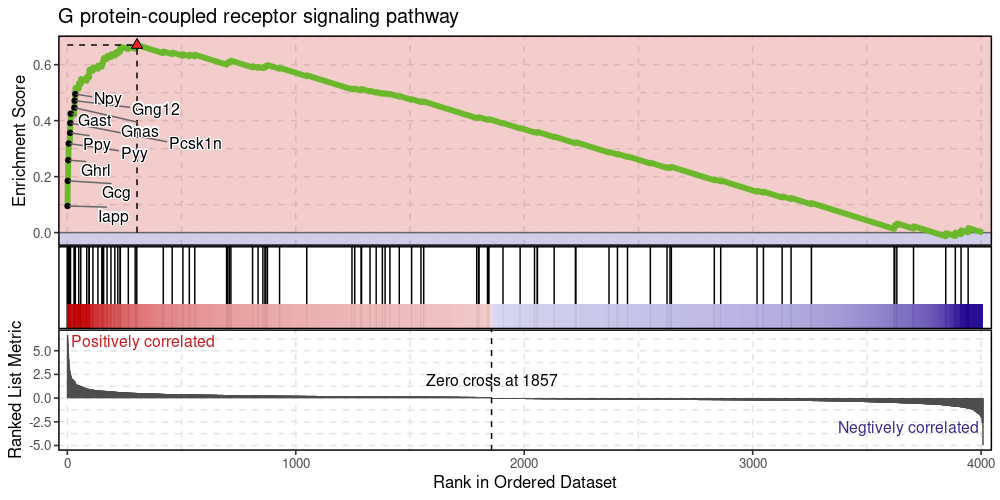

**Dynamic features analysis**:

``` r
pancreas1k <- RunSlingshot(pancreas1k, group.by = "SubCellType", reduction = "UMAP", show_plot = TRUE)
```

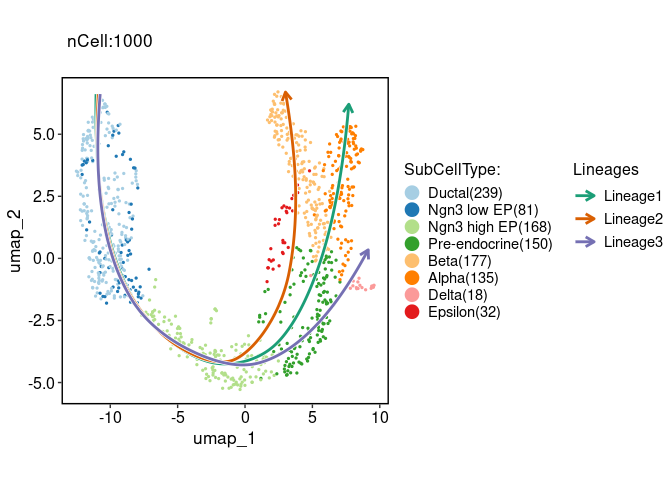

``` r
pancreas1k <- RunDynamicFeatures(pancreas1k, lineages = c("Lineage1", "Lineage2"), n_candidates = 200)
#> [2022-06-16 17:33:25] Start RunDynamicFeatures
#> Number of candidate features(union): 225
#> Calculate dynamic features for Lineage1...
#>   |                                                                              |                                                                      |   0%  |                                                                              |=                                                                     |   1%  |                                                                              |=                                                                     |   2%  |                                                                              |==                                                                    |   2%  |                                                                              |==                                                                    |   3%  |                                                                              |===                                                                   |   4%  |                                                                              |===                                                                   |   5%  |                                                                              |====                                                                  |   6%  |                                                                              |=====                                                                 |   6%  |                                                                              |=====                                                                 |   7%  |                                                                              |======                                                                |   8%  |                                                                              |======                                                                |   9%  |                                                                              |=======                                                               |  10%  |                                                                              |========                                                              |  11%  |                                                                              |========                                                              |  12%  |                                                                              |=========                                                             |  13%  |                                                                              |==========                                                            |  14%  |                                                                              |==========                                                            |  15%  |                                                                              |===========                                                           |  15%  |                                                                              |===========                                                           |  16%  |                                                                              |============                                                          |  17%  |                                                                              |============                                                          |  18%  |                                                                              |=============                                                         |  19%  |                                                                              |==============                                                        |  19%  |                                                                              |==============                                                        |  20%  |                                                                              |===============                                                       |  21%  |                                                                              |===============                                                       |  22%  |                                                                              |================                                                      |  23%  |                                                                              |=================                                                     |  24%  |                                                                              |==================                                                    |  25%  |                                                                              |==================                                                    |  26%  |                                                                              |===================                                                   |  27%  |                                                                              |====================                                                  |  28%  |                                                                              |====================                                                  |  29%  |                                                                              |=====================                                                 |  30%  |                                                                              |=====================                                                 |  31%  |                                                                              |======================                                                |  31%  |                                                                              |=======================                                               |  32%  |                                                                              |=======================                                               |  33%  |                                                                              |========================                                              |  34%  |                                                                              |========================                                              |  35%  |                                                                              |=========================                                             |  35%  |                                                                              |=========================                                             |  36%  |                                                                              |==========================                                            |  37%  |                                                                              |===========================                                           |  38%  |                                                                              |===========================                                           |  39%  |                                                                              |============================                                          |  40%  |                                                                              |=============================                                         |  41%  |                                                                              |=============================                                         |  42%  |                                                                              |==============================                                        |  43%  |                                                                              |==============================                                        |  44%  |                                                                              |===============================                                       |  44%  |                                                                              |================================                                      |  45%  |                                                                              |================================                                      |  46%  |                                                                              |=================================                                     |  47%  |                                                                              |=================================                                     |  48%  |                                                                              |==================================                                    |  48%  |                                                                              |==================================                                    |  49%  |                                                                              |===================================                                   |  50%  |                                                                              |====================================                                  |  51%  |                                                                              |====================================                                  |  52%  |                                                                              |=====================================                                 |  52%  |                                                                              |=====================================                                 |  53%  |                                                                              |======================================                                |  54%  |                                                                              |======================================                                |  55%  |                                                                              |=======================================                               |  56%  |                                                                              |========================================                              |  56%  |                                                                              |========================================                              |  57%  |                                                                              |=========================================                             |  58%  |                                                                              |=========================================                             |  59%  |                                                                              |==========================================                            |  60%  |                                                                              |===========================================                           |  61%  |                                                                              |===========================================                           |  62%  |                                                                              |============================================                          |  63%  |                                                                              |=============================================                         |  64%  |                                                                              |=============================================                         |  65%  |                                                                              |==============================================                        |  65%  |                                                                              |==============================================                        |  66%  |                                                                              |===============================================                       |  67%  |                                                                              |===============================================                       |  68%  |                                                                              |================================================                      |  69%  |                                                                              |=================================================                     |  69%  |                                                                              |=================================================                     |  70%  |                                                                              |==================================================                    |  71%  |                                                                              |==================================================                    |  72%  |                                                                              |===================================================                   |  73%  |                                                                              |====================================================                  |  74%  |                                                                              |====================================================                  |  75%  |                                                                              |=====================================================                 |  76%  |                                                                              |======================================================                |  77%  |                                                                              |=======================================================               |  78%  |                                                                              |=======================================================               |  79%  |                                                                              |========================================================              |  80%  |                                                                              |========================================================              |  81%  |                                                                              |=========================================================             |  81%  |                                                                              |==========================================================            |  82%  |                                                                              |==========================================================            |  83%  |                                                                              |===========================================================           |  84%  |                                                                              |===========================================================           |  85%  |                                                                              |============================================================          |  85%  |                                                                              |============================================================          |  86%  |                                                                              |=============================================================         |  87%  |                                                                              |==============================================================        |  88%  |                                                                              |==============================================================        |  89%  |                                                                              |===============================================================       |  90%  |                                                                              |================================================================      |  91%  |                                                                              |================================================================      |  92%  |                                                                              |=================================================================     |  93%  |                                                                              |=================================================================     |  94%  |                                                                              |==================================================================    |  94%  |                                                                              |===================================================================   |  95%  |                                                                              |===================================================================   |  96%  |                                                                              |====================================================================  |  97%  |                                                                              |====================================================================  |  98%  |                                                                              |===================================================================== |  98%  |                                                                              |===================================================================== |  99%  |                                                                              |======================================================================| 100%
#> Calculate dynamic features for Lineage2...
#>   |                                                                              |                                                                      |   0%  |                                                                              |=                                                                     |   1%  |                                                                              |=                                                                     |   2%  |                                                                              |==                                                                    |   2%  |                                                                              |==                                                                    |   3%  |                                                                              |===                                                                   |   4%  |                                                                              |===                                                                   |   5%  |                                                                              |====                                                                  |   6%  |                                                                              |=====                                                                 |   6%  |                                                                              |=====                                                                 |   7%  |                                                                              |======                                                                |   8%  |                                                                              |======                                                                |   9%  |                                                                              |=======                                                               |  10%  |                                                                              |========                                                              |  11%  |                                                                              |========                                                              |  12%  |                                                                              |=========                                                             |  13%  |                                                                              |==========                                                            |  14%  |                                                                              |==========                                                            |  15%  |                                                                              |===========                                                           |  15%  |                                                                              |===========                                                           |  16%  |                                                                              |============                                                          |  17%  |                                                                              |============                                                          |  18%  |                                                                              |=============                                                         |  19%  |                                                                              |==============                                                        |  19%  |                                                                              |==============                                                        |  20%  |                                                                              |===============                                                       |  21%  |                                                                              |===============                                                       |  22%  |                                                                              |================                                                      |  23%  |                                                                              |=================                                                     |  24%  |                                                                              |==================                                                    |  25%  |                                                                              |==================                                                    |  26%  |                                                                              |===================                                                   |  27%  |                                                                              |====================                                                  |  28%  |                                                                              |====================                                                  |  29%  |                                                                              |=====================                                                 |  30%  |                                                                              |=====================                                                 |  31%  |                                                                              |======================                                                |  31%  |                                                                              |=======================                                               |  32%  |                                                                              |=======================                                               |  33%  |                                                                              |========================                                              |  34%  |                                                                              |========================                                              |  35%  |                                                                              |=========================                                             |  35%  |                                                                              |=========================                                             |  36%  |                                                                              |==========================                                            |  37%  |                                                                              |===========================                                           |  38%  |                                                                              |===========================                                           |  39%  |                                                                              |============================                                          |  40%  |                                                                              |=============================                                         |  41%  |                                                                              |=============================                                         |  42%  |                                                                              |==============================                                        |  43%  |                                                                              |==============================                                        |  44%  |                                                                              |===============================                                       |  44%  |                                                                              |================================                                      |  45%  |                                                                              |================================                                      |  46%  |                                                                              |=================================                                     |  47%  |                                                                              |=================================                                     |  48%  |                                                                              |==================================                                    |  48%  |                                                                              |==================================                                    |  49%  |                                                                              |===================================                                   |  50%  |                                                                              |====================================                                  |  51%  |                                                                              |====================================                                  |  52%  |                                                                              |=====================================                                 |  52%  |                                                                              |=====================================                                 |  53%  |                                                                              |======================================                                |  54%  |                                                                              |======================================                                |  55%  |                                                                              |=======================================                               |  56%  |                                                                              |========================================                              |  56%  |                                                                              |========================================                              |  57%  |                                                                              |=========================================                             |  58%  |                                                                              |=========================================                             |  59%  |                                                                              |==========================================                            |  60%  |                                                                              |===========================================                           |  61%  |                                                                              |===========================================                           |  62%  |                                                                              |============================================                          |  63%  |                                                                              |=============================================                         |  64%  |                                                                              |=============================================                         |  65%  |                                                                              |==============================================                        |  65%  |                                                                              |==============================================                        |  66%  |                                                                              |===============================================                       |  67%  |                                                                              |===============================================                       |  68%  |                                                                              |================================================                      |  69%  |                                                                              |=================================================                     |  69%  |                                                                              |=================================================                     |  70%  |                                                                              |==================================================                    |  71%  |                                                                              |==================================================                    |  72%  |                                                                              |===================================================                   |  73%  |                                                                              |====================================================                  |  74%  |                                                                              |====================================================                  |  75%  |                                                                              |=====================================================                 |  76%  |                                                                              |======================================================                |  77%  |                                                                              |=======================================================               |  78%  |                                                                              |=======================================================               |  79%  |                                                                              |========================================================              |  80%  |                                                                              |========================================================              |  81%  |                                                                              |=========================================================             |  81%  |                                                                              |==========================================================            |  82%  |                                                                              |==========================================================            |  83%  |                                                                              |===========================================================           |  84%  |                                                                              |===========================================================           |  85%  |                                                                              |============================================================          |  85%  |                                                                              |============================================================          |  86%  |                                                                              |=============================================================         |  87%  |                                                                              |==============================================================        |  88%  |                                                                              |==============================================================        |  89%  |                                                                              |===============================================================       |  90%  |                                                                              |================================================================      |  91%  |                                                                              |================================================================      |  92%  |                                                                              |=================================================================     |  93%  |                                                                              |=================================================================     |  94%  |                                                                              |==================================================================    |  94%  |                                                                              |===================================================================   |  95%  |                                                                              |===================================================================   |  96%  |                                                                              |====================================================================  |  97%  |                                                                              |====================================================================  |  98%  |                                                                              |===================================================================== |  98%  |                                                                              |===================================================================== |  99%  |                                                                              |======================================================================| 100%
#> 
#> [2022-06-16 17:34:25] RunDynamicFeatures done
#> Elapsed time: 59.02 secs
ht_result <- DynamicHeatmap(pancreas1k,
  lineages = c("Lineage1", "Lineage2"), cell_annotation = "SubCellType",
  n_cluster = 6, reverse_ht = "Lineage1", height = 5, width = 7, use_raster = FALSE
)
#> Warning in fun(libname, pkgname): couldn't connect to display ":0"
#> Loading required package: Mfuzz
#> Loading required package: e1071
ht_result$plot
```

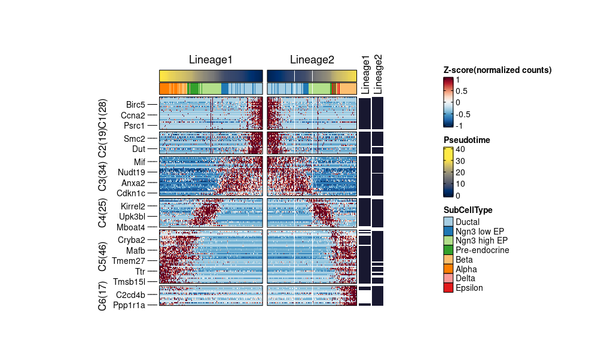

``` r
DynamicPlot(pancreas1k,
  lineages = c("Lineage1", "Lineage2"), features = c("Nnat", "Irx1"), group.by = "SubCellType",
  compare_lineages = TRUE, compare_features = FALSE
)
```

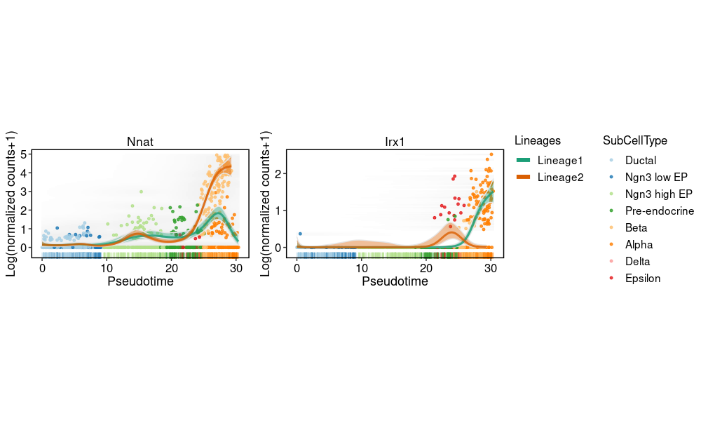

**Cell projection between single-cell datasets**:

``` r
library(stringr)
panc8 <- RenameFeatures(panc8, newnames = make.unique(str_to_title(rownames(panc8))))
#> Rename features for the assay: RNA
#> Rename features for the assay: Seurat
pancreas1k <- RunKNNMap(srt_query = pancreas1k, srt_ref = panc8, ref_umap = "SeuratUMAP2D")
#> Use the features to calculate distance metric.
#> Detected srt_query data type: log_normalized_counts
#> Detected srt_ref data type: log_normalized_counts
#> Use 569 common features to calculate distance.
#> Use 'raw' method to find neighbors.
#> Running UMAP projection
#> 17:34:46 Read 1000 rows
#> 17:34:46 Processing block 1 of 1
#> 17:34:46 Commencing smooth kNN distance calibration using 1 thread
#> 17:34:46 Initializing by weighted average of neighbor coordinates using 1 thread
#> 17:34:46 Commencing optimization for 67 epochs, with 30000 positive edges
#> 17:34:46 Finished
ProjectionPlot(srt_query = pancreas1k, srt_ref = panc8, query_group = "SubCellType", ref_group = "celltype")
#> Warning: Removed 7 rows containing missing values (geom_point).
#> Removed 7 rows containing missing values (geom_point).
```

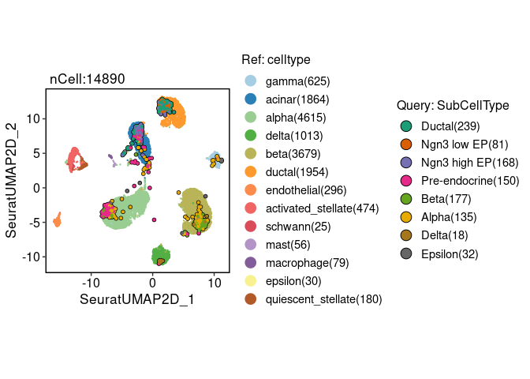

**Cell annotation using bulk RNA-seq datasets**:

``` r
pancreas1k <- RunKNNPredict(srt_query = pancreas1k, bulk_ref = SCP::ref_scMCA, filter_lowfreq = 20)
#> Use 535 common features to calculate distance.
#> Detected query data type: log_normalized_counts
#> Detected reference data type: log_normalized_counts
#> Calculate similarity...
#> Use 'raw' method to find neighbors.
#> Predict cell type...
ClassDimPlot(pancreas1k, group.by = "knnpredict_classification", label = TRUE)
#> Warning in grid.Call(C_textBounds, as.graphicsAnnot(x$label), x$x, x$y, :
#> conversion failure on '5: β-cell(Pancreas)(31)' in 'mbcsToSbcs': dot substituted
#> for <ce>
#> Warning in grid.Call(C_textBounds, as.graphicsAnnot(x$label), x$x, x$y, :
#> conversion failure on '5: β-cell(Pancreas)(31)' in 'mbcsToSbcs': dot substituted
#> for <b2>
#> Warning in grid.Call(C_textBounds, as.graphicsAnnot(x$label), x$x, x$y, :
#> conversion failure on '5: β-cell(Pancreas)(31)' in 'mbcsToSbcs': dot substituted
#> for <ce>
#> Warning in grid.Call(C_textBounds, as.graphicsAnnot(x$label), x$x, x$y, :
#> conversion failure on '5: β-cell(Pancreas)(31)' in 'mbcsToSbcs': dot substituted
#> for <b2>
#> Warning in grid.Call(C_textBounds, as.graphicsAnnot(x$label), x$x, x$y, :
#> conversion failure on '5: β-cell(Pancreas)(31)' in 'mbcsToSbcs': dot substituted
#> for <ce>
#> Warning in grid.Call(C_textBounds, as.graphicsAnnot(x$label), x$x, x$y, :
#> conversion failure on '5: β-cell(Pancreas)(31)' in 'mbcsToSbcs': dot substituted
#> for <b2>
#> Warning in grid.Call(C_textBounds, as.graphicsAnnot(x$label), x$x, x$y, :
#> conversion failure on '5: β-cell(Pancreas)(31)' in 'mbcsToSbcs': dot substituted
#> for <ce>
#> Warning in grid.Call(C_textBounds, as.graphicsAnnot(x$label), x$x, x$y, :
#> conversion failure on '5: β-cell(Pancreas)(31)' in 'mbcsToSbcs': dot substituted
#> for <b2>
#> Warning in grid.Call(C_textBounds, as.graphicsAnnot(x$label), x$x, x$y, :
#> conversion failure on '5: β-cell(Pancreas)(31)' in 'mbcsToSbcs': dot substituted
#> for <ce>
#> Warning in grid.Call(C_textBounds, as.graphicsAnnot(x$label), x$x, x$y, :
#> conversion failure on '5: β-cell(Pancreas)(31)' in 'mbcsToSbcs': dot substituted
#> for <b2>
#> Warning in grid.Call(C_textBounds, as.graphicsAnnot(x$label), x$x, x$y, :
#> conversion failure on '5: β-cell(Pancreas)(31)' in 'mbcsToSbcs': dot substituted
#> for <ce>
#> Warning in grid.Call(C_textBounds, as.graphicsAnnot(x$label), x$x, x$y, :
#> conversion failure on '5: β-cell(Pancreas)(31)' in 'mbcsToSbcs': dot substituted
#> for <b2>
#> Warning in grid.Call(C_textBounds, as.graphicsAnnot(x$label), x$x, x$y, :
#> conversion failure on '5: β-cell(Pancreas)(31)' in 'mbcsToSbcs': dot substituted
#> for <ce>
#> Warning in grid.Call(C_textBounds, as.graphicsAnnot(x$label), x$x, x$y, :
#> conversion failure on '5: β-cell(Pancreas)(31)' in 'mbcsToSbcs': dot substituted
#> for <b2>
#> Warning in grid.Call(C_textBounds, as.graphicsAnnot(x$label), x$x, x$y, :
#> conversion failure on '5: β-cell(Pancreas)(31)' in 'mbcsToSbcs': dot substituted
#> for <ce>
#> Warning in grid.Call(C_textBounds, as.graphicsAnnot(x$label), x$x, x$y, :
#> conversion failure on '5: β-cell(Pancreas)(31)' in 'mbcsToSbcs': dot substituted
#> for <b2>
#> Warning in grid.Call(C_textBounds, as.graphicsAnnot(x$label), x$x, x$y, :
#> conversion failure on '5: β-cell(Pancreas)(31)' in 'mbcsToSbcs': dot substituted
#> for <ce>
#> Warning in grid.Call(C_textBounds, as.graphicsAnnot(x$label), x$x, x$y, :
#> conversion failure on '5: β-cell(Pancreas)(31)' in 'mbcsToSbcs': dot substituted
#> for <b2>
#> Warning in grid.Call(C_textBounds, as.graphicsAnnot(x$label), x$x, x$y, :
#> conversion failure on '5: β-cell(Pancreas)(31)' in 'mbcsToSbcs': dot substituted
#> for <ce>
#> Warning in grid.Call(C_textBounds, as.graphicsAnnot(x$label), x$x, x$y, :
#> conversion failure on '5: β-cell(Pancreas)(31)' in 'mbcsToSbcs': dot substituted
#> for <b2>
```

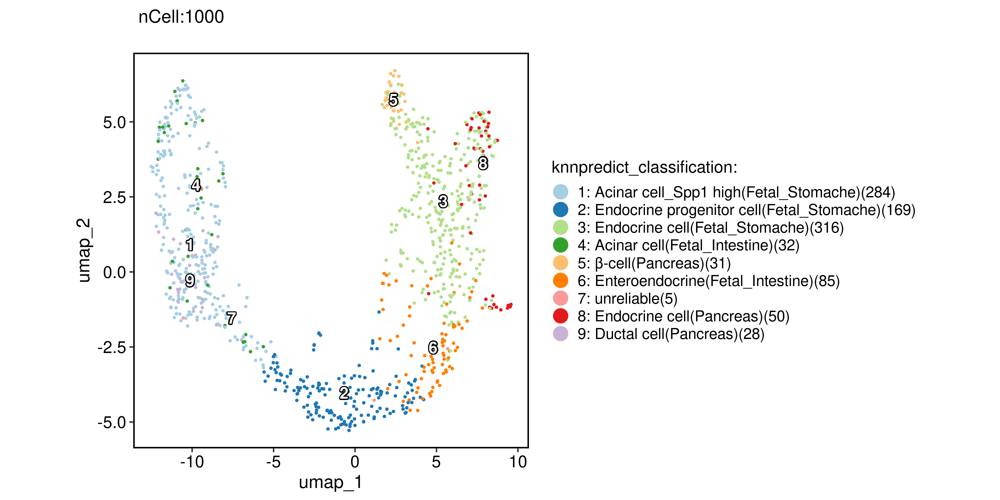

**Cell annotation using single-cell datasets**:

``` r
pancreas1k <- RunKNNPredict(srt_query = pancreas1k, srt_ref = panc8, ref_group = "celltype", filter_lowfreq = 20)
#> Use the HVF to calculate distance metric.
#> Use 569 common features to calculate distance.
#> Detected query data type: log_normalized_counts
#> Detected reference data type: log_normalized_counts
#> Calculate similarity...
#> Use 'raw' method to find neighbors.
#> Predict cell type...
ClassDimPlot(pancreas1k, group.by = "knnpredict_classification", label = TRUE)
```


**PAGA analysis**:

``` r
pancreas1k <- RunPAGA(srt = pancreas1k, group_by = "SubCellType", liner_reduction = "PCA", nonliner_reduction = "UMAP", return_seurat = TRUE)
#> 'misc' slot in the srt object is not be converted.
#> 'tools' slot in the srt object is not be converted.
#> Warning: Keys should be one or more alphanumeric characters followed by an
#> underscore, setting key from ref.umap_ to refumap_
#> Warning: All keys should be one or more alphanumeric characters followed by an
#> underscore '_', setting key to refumap_
#> Warning in adata_to_srt(adata): 'uns: neighbors' will not be converted. It
#> is a Python object connected with the Python session. You may need to convert
#> manually.
PAGAPlot(pancreas1k, label = TRUE, label_insitu = TRUE, label_repel = TRUE)
```

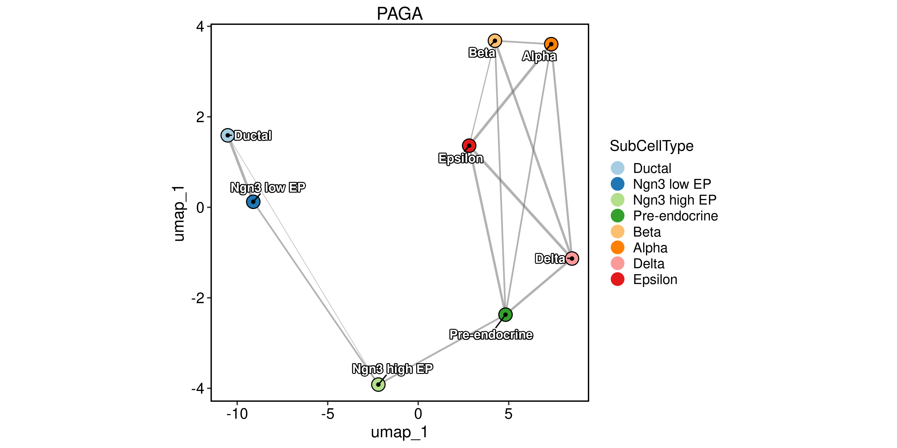

**Velocity analysis**:

``` r
pancreas1k <- RunSCVELO(srt = pancreas1k, group_by = "SubCellType", liner_reduction = "PCA", nonliner_reduction = "UMAP", return_seurat = TRUE)
#> 'misc' slot in the srt object is not be converted.
#> 'tools' slot in the srt object is not be converted.
#> Warning: Keys should be one or more alphanumeric characters followed by an
#> underscore, setting key from variance_stochastic_ to variancestochastic_
#> Warning: Keys should be one or more alphanumeric characters followed by an
#> underscore, setting key from variance_velocity_ to variancevelocity_
#> Warning: Keys should be one or more alphanumeric characters followed by an
#> underscore, setting key from ref.umap_ to refumap_
#> Warning: All keys should be one or more alphanumeric characters followed by an
#> underscore '_', setting key to refumap_
#> Warning: Keys should be one or more alphanumeric characters followed by an
#> underscore, setting key from X_UMAP_ to XUMAP_
#> Warning: All keys should be one or more alphanumeric characters followed by an
#> underscore '_', setting key to XUMAP_
#> Warning: Keys should be one or more alphanumeric characters followed by an
#> underscore, setting key from stochastic_UMAP_ to stochasticUMAP_
#> Warning: All keys should be one or more alphanumeric characters followed by an
#> underscore '_', setting key to stochasticUMAP_
#> Warning in adata_to_srt(adata): 'uns: neighbors' will not be converted. It
#> is a Python object connected with the Python session. You may need to convert
#> manually.
VelocityPlot(pancreas1k, reduction = "UMAP", group_by = "SubCellType")
```

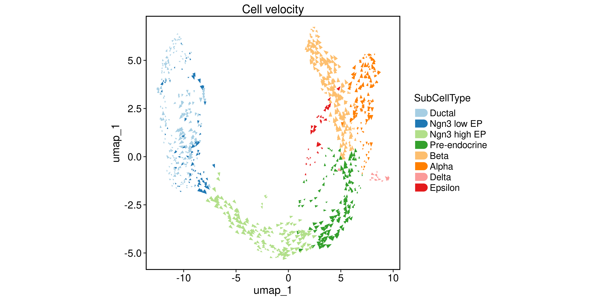

``` r
VelocityPlot(pancreas1k, reduction = "UMAP", plot_type = "stream")
```

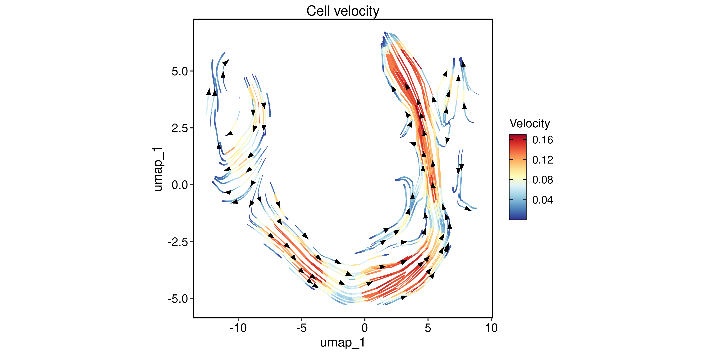
