# SCP: Single Cell Pipeline

<!-- badges: start -->

[](https://github.com/zhanghao-njmu/SCP)
[](https://github.com/zhanghao-njmu/SCP/actions)
[](https://github.com/zhanghao-njmu/SCP)

<!-- badges: end -->

The SCP package provides a comprehensive set of tools for single cell
data processing and downstream analysis.

The package includes facilities for:

-   Integrated single cell quality control methods.
-   Pipelines embedded with multiple methods for normalization, feature
    reduction, and cell population identification (standard Seurat
    workflow).
-   Pipelines embedded with multiple data integration methods, including
    Uncorrected, [Seurat](https://github.com/satijalab/seurat),
    [scVI](https://github.com/scverse/scvi-tools),
    [MNN](http://www.bioconductor.org/packages/release/bioc/html/batchelor.html),
    [fastMNN](http://www.bioconductor.org/packages/release/bioc/html/batchelor.html),
    [Harmony](https://github.com/immunogenomics/harmony),
    [Scanorama](https://github.com/brianhie/scanorama),
    [BBKNN](https://github.com/Teichlab/bbknn),
    [CSS](https://github.com/quadbiolab/simspec),
    [LIGER](https://github.com/welch-lab/liger),
    [Conos](https://github.com/kharchenkolab/conos).
-   Multiple single cell downstream analyses such as identification of
    differential features, enrichment analysis, GSEA analysis,
    identification of dynamic features,
    [PAGA](https://github.com/theislab/paga), [RNA
    velocity](https://github.com/theislab/scvelo),
    [Palantir](https://github.com/dpeerlab/Palantir),
    [Monocle2](http://cole-trapnell-lab.github.io/monocle-release),
    [Monocle3](https://cole-trapnell-lab.github.io/monocle3), etc.
-   Multiple methods for automatic annotation of single-cell data and
    methods for projection between single-cell datasets.
-   High quality data visualization methods.
-   Fast deployment of single-cell data into SCExplorer, a [shiny
    app](https://shiny.rstudio.com/) that provides an interactive
    visualization interface.

The functions in the SCP package are all developed around the [Seurat
object](https://github.com/mojaveazure/seurat-object) and compatible
with other Seurat functions.

## Installation

You can install the development version of SCP from
[GitHub](https://github.com/zhanghao-njmu/SCP) with:

``` r
if (!require("devtools", quietly = TRUE)) {
  install.packages("devtools")
}
devtools::install_github("zhanghao-njmu/SCP")
```

### Requirement for python functions in SCP

To run functions such as `RunSCVELO` or `RunPAGA`, SCP requires python
3.7-3.9 to be installed in the environment.

Check the version of python in the terminal:

``` shell
python3 --version
```

or in the R environment:

``` r
if (!require("reticulate", quietly = TRUE)) {
  install.packages("reticulate")
}
py <- Sys.which("python3")
reticulate:::python_version(py)
```

Then run `PrepareVirtualEnv` to create a standalone python virtual
environment for SCP and install the necessary packages.

``` r
SCP::PrepareVirtualEnv(python = py, pypi_mirror = "https://pypi.tuna.tsinghua.edu.cn/simple", remove_old = TRUE)
reticulate::virtualenv_python("SCP")
```

## Example

### Load the Data

The analysis is based on a subsetted version of [mouse pancreas
data](https://doi.org/10.1242/dev.173849).

``` r
library(SCP)
data("pancreas_sub")
ClassDimPlot(
  srt = pancreas_sub, group.by = c("CellType", "SubCellType"),
  reduction = "UMAP", theme_use = "theme_blank"
)
```

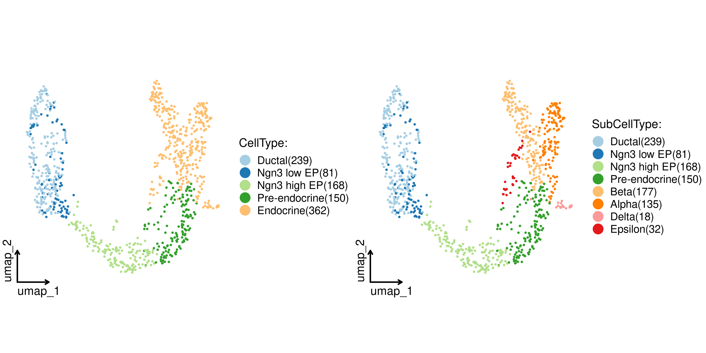

``` r
ClassDimPlot(
  srt = pancreas_sub, group.by = "SubCellType", stat.by = "Phase",
  reduction = "UMAP", theme_use = "theme_blank"
)
```

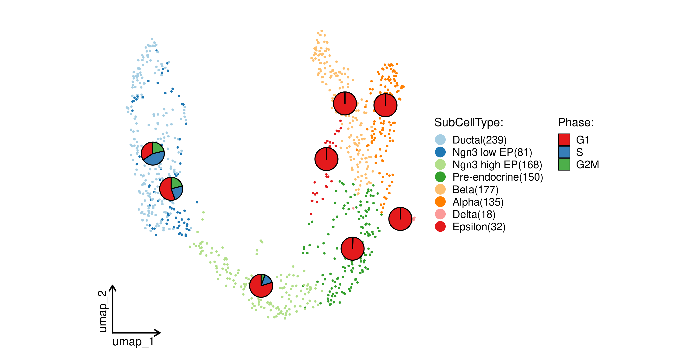

``` r
ExpDimPlot(
  srt = pancreas_sub, features = c("Sox9", "Neurog3", "Fev", "Rbp4"),
  reduction = "UMAP", theme_use = "theme_blank"
)
```

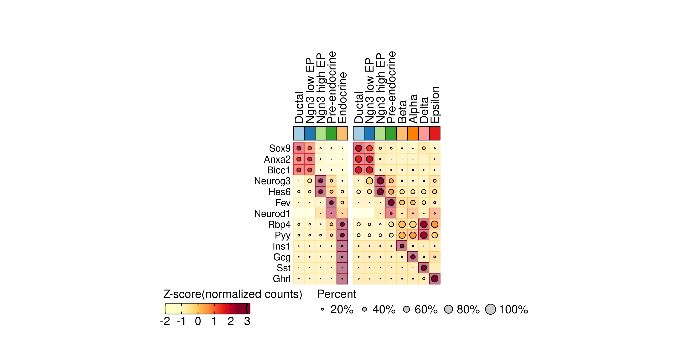

``` r
ExpDimPlot(
  srt = pancreas_sub, features = c("Ins1", "Gcg", "Sst", "Ghrl"),
  compare_features = TRUE, label = TRUE, label_insitu = TRUE,
  reduction = "UMAP", theme_use = "theme_blank"
)
```

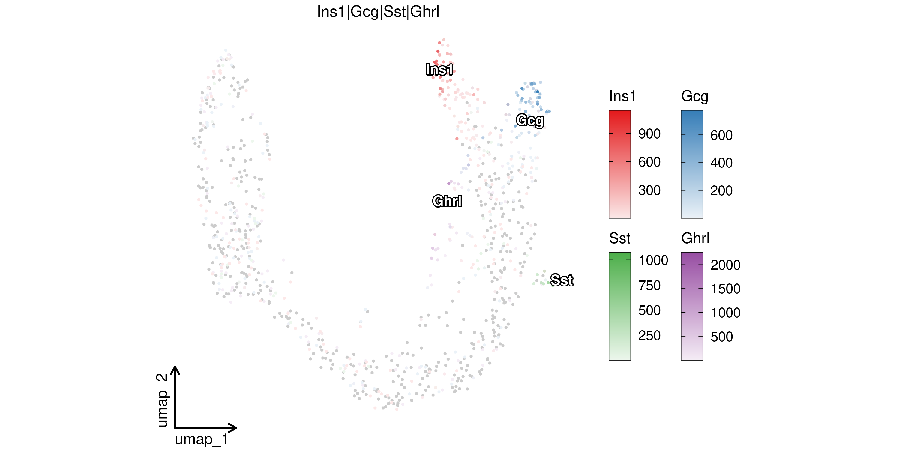

``` r
ht <- GroupHeatmap(
  srt = pancreas_sub,
  features = c(
    "Sox9", "Anxa2", # Ductal
    "Neurog3", "Hes6", # EPs
    "Fev", "Neurod1", # Pre-endocrine
    "Rbp4", "Pyy", # Endocrine
    "Ins1", "Gcg", "Sst", "Ghrl" # Beta, Alpha, Delta, Epsilon
  ),
  group.by = c("CellType", "SubCellType"),
  cell_annotation = c("Phase", "G2M_score", "Neurod2"),
  cell_palette = c("Dark2", "Paired", "Paired"),
  add_dot = TRUE, add_reticle = TRUE
)
print(ht$plot)
```

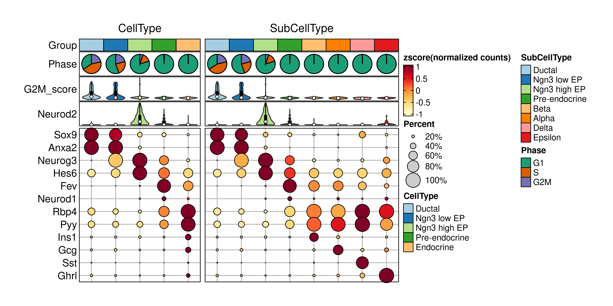

### CellQC

``` r
pancreas_sub <- RunCellQC(srt = pancreas_sub)
ClassDimPlot(srt = pancreas_sub, group.by = "CellQC", reduction = "UMAP")
```

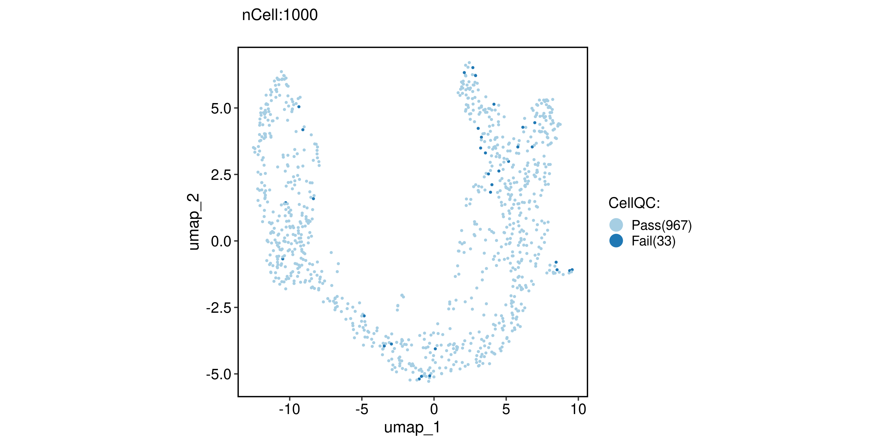

``` r
ClassStatPlot(srt = pancreas_sub, stat.by = "CellQC", group.by = "CellType", label = TRUE)
```

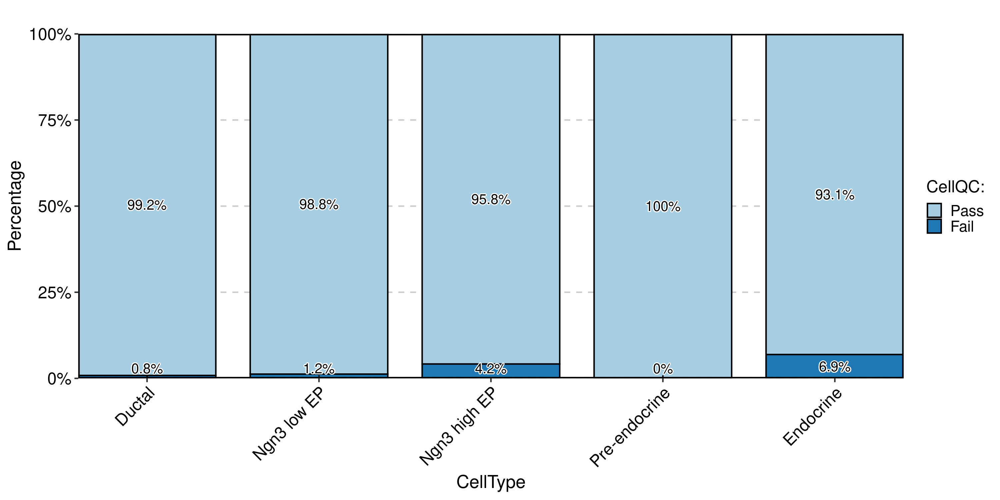

``` r
ClassStatPlot(
  srt = pancreas_sub,
  stat.by = c(
    "db_qc", "outlier_qc", "umi_qc", "gene_qc",
    "mito_qc", "ribo_qc", "ribo_mito_ratio_qc", "species_qc"
  ),
  plot_type = "upset", stat_level = "Fail"
)
```

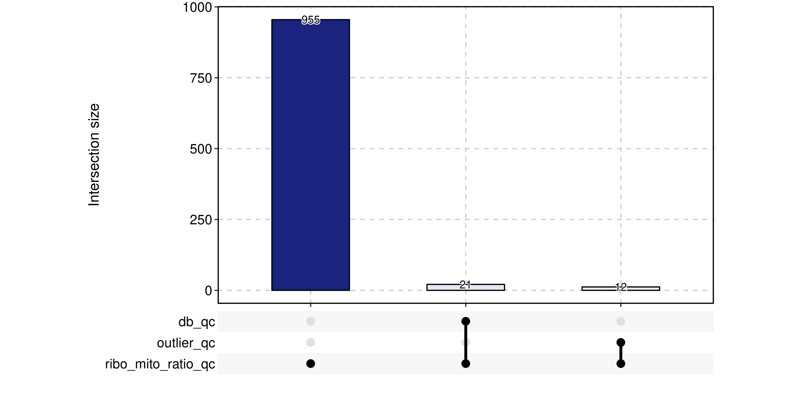

### Standard pipeline in SCP

``` r
pancreas_sub <- Standard_SCP(srt = pancreas_sub)
ClassDimPlot(
  srt = pancreas_sub, group.by = c("CellType", "SubCellType"),
  reduction = "StandardUMAP2D", theme_use = "theme_blank"
)
```

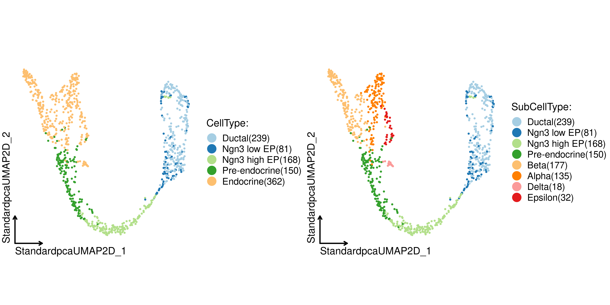

``` r
ClassDimPlot3D(srt = pancreas_sub, group.by = "SubCellType")
```


``` r
ExpDimPlot3D(srt = pancreas_sub, features = c("Sox9", "Neurog3", "Fev", "Rbp4"))
```


### Integration pipeline in SCP

Example data for integration is a subsetted version of [panc8(eight
human pancreas datasets)](https://github.com/satijalab/seurat-data)

``` r
data("panc8_sub")
panc8_sub <- Integration_SCP(srtMerge = panc8_sub, batch = "tech", integration_method = "Seurat")
panc8_sub <- Integration_SCP(srtMerge = panc8_sub, batch = "tech", integration_method = "Harmony")
ClassDimPlot(
  srt = panc8_sub, group.by = c("celltype", "tech"), reduction = "SeuratUMAP2D",
  title = "Seurat", theme_use = "theme_blank"
)
```

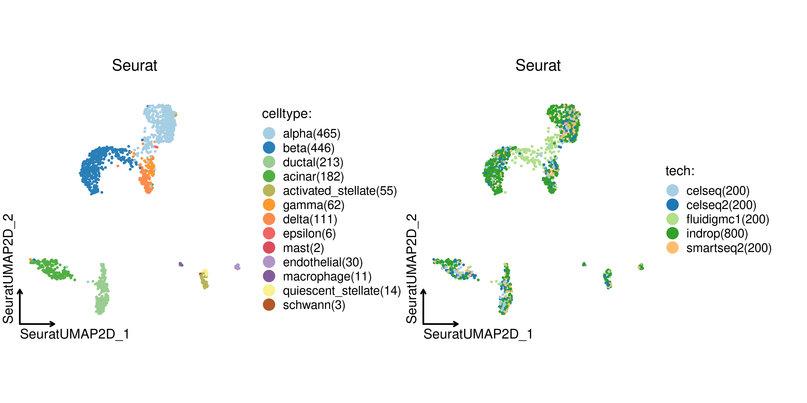

``` r
ClassDimPlot(
  srt = panc8_sub, group.by = c("celltype", "tech"), reduction = "HarmonyUMAP2D",
  title = "Harmony", theme_use = "theme_blank"
)
```

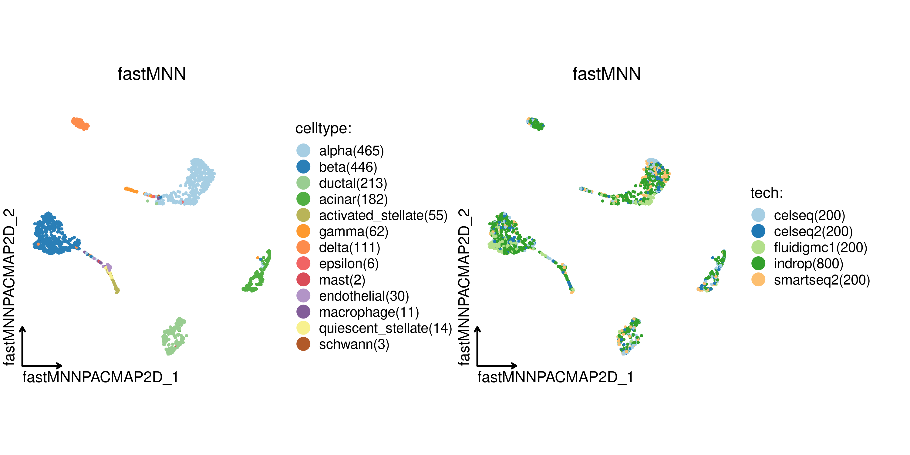

### Cell projection between single-cell datasets

``` r
panc8_rename <- RenameFeatures(srt = panc8_sub, newnames = make.unique(stringr::str_to_title(rownames(panc8_sub))), assays = "RNA")
pancreas_sub <- RunKNNMap(srt_query = pancreas_sub, srt_ref = panc8_rename, ref_umap = "SeuratUMAP2D")
ProjectionPlot(
  srt_query = pancreas_sub, srt_ref = panc8_rename,
  query_group = "SubCellType", ref_group = "celltype"
)
```

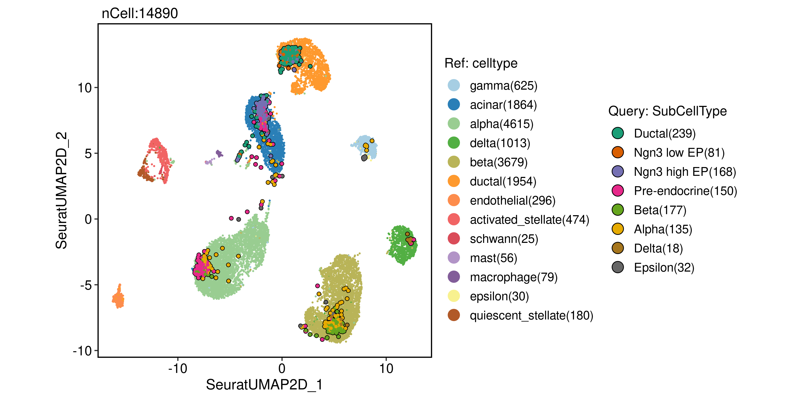

### Cell annotation using bulk RNA-seq datasets

``` r
data("ref_scMCA")
pancreas_sub <- RunKNNPredict(srt_query = pancreas_sub, bulk_ref = ref_scMCA, filter_lowfreq = 20)
ClassDimPlot(srt = pancreas_sub, group.by = "knnpredict_classification", reduction = "UMAP", label = TRUE)
```


### Cell annotation using single-cell datasets

``` r
pancreas_sub <- RunKNNPredict(
  srt_query = pancreas_sub, srt_ref = panc8_rename,
  ref_group = "celltype", filter_lowfreq = 20
)
ClassDimPlot(srt = pancreas_sub, group.by = "knnpredict_classification", reduction = "UMAP", label = TRUE)
```

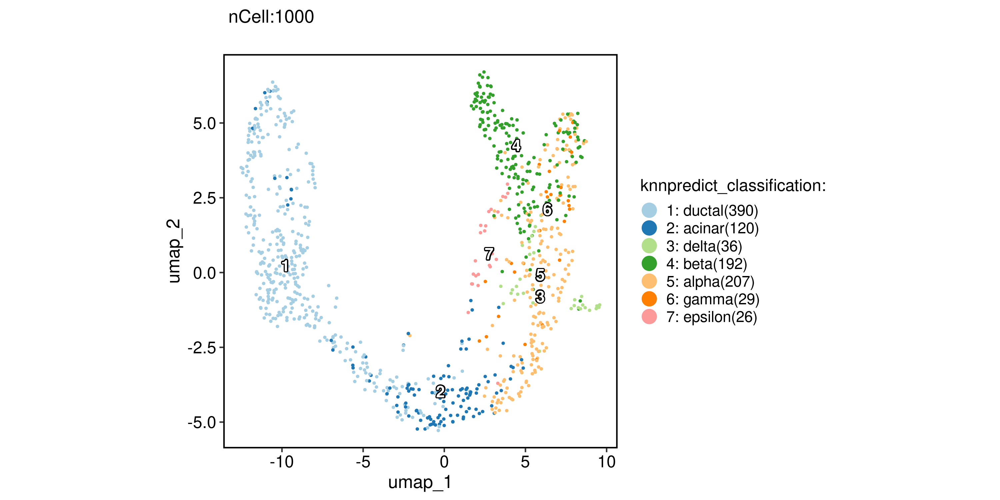

### PAGA analysis

``` r
pancreas_sub <- RunPAGA(
  srt = pancreas_sub, group_by = "SubCellType",
  linear_reduction = "PCA", nonlinear_reduction = "UMAP", return_seurat = TRUE
)
PAGAPlot(srt = pancreas_sub, reduction = "UMAP", label = TRUE, label_insitu = TRUE, label_repel = TRUE)
```

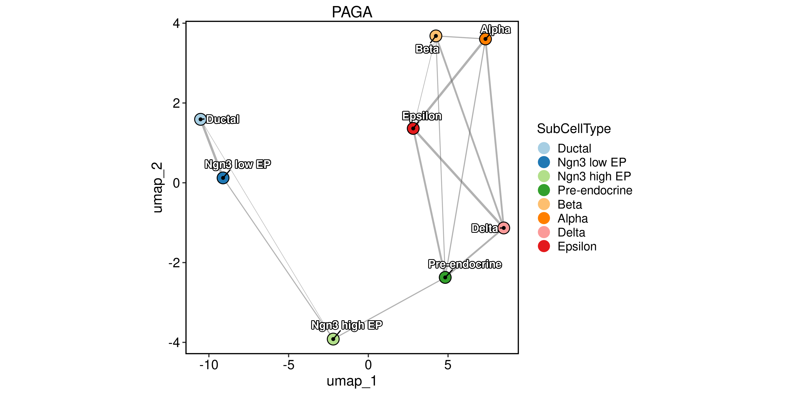

### Velocity analysis

``` r
pancreas_sub <- RunSCVELO(
  srt = pancreas_sub, group_by = "SubCellType",
  linear_reduction = "PCA", nonlinear_reduction = "UMAP", return_seurat = TRUE
)
VelocityPlot(srt = pancreas_sub, reduction = "UMAP", group_by = "SubCellType")
```

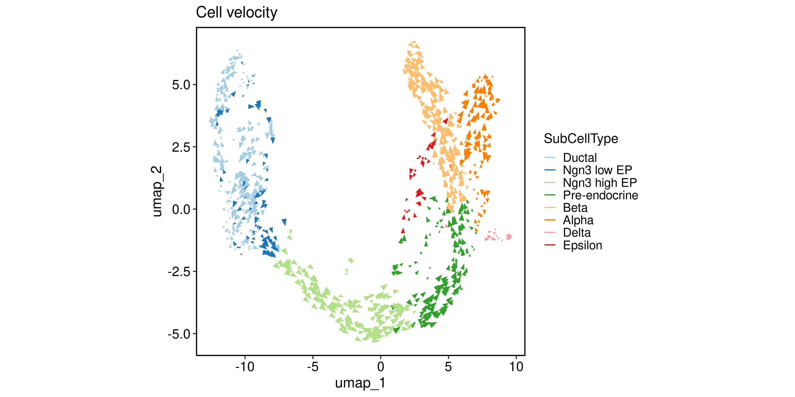

``` r
VelocityPlot(srt = pancreas_sub, reduction = "UMAP", plot_type = "stream")
```

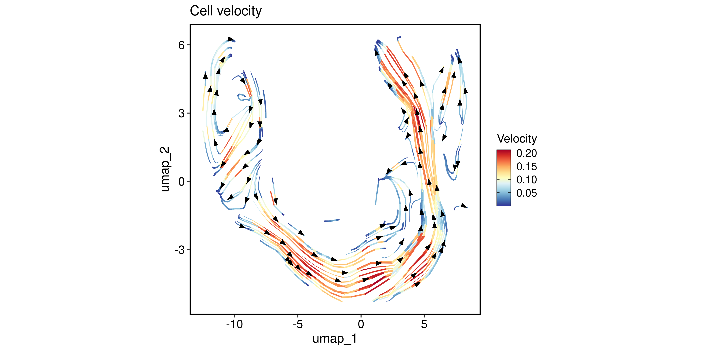

### Differential expression analysis

``` r
pancreas_sub <- RunDEtest(srt = pancreas_sub, group_by = "CellType", fc.threshold = 1, only.pos = FALSE)
VolcanoPlot(srt = pancreas_sub, group_by = "CellType")
```

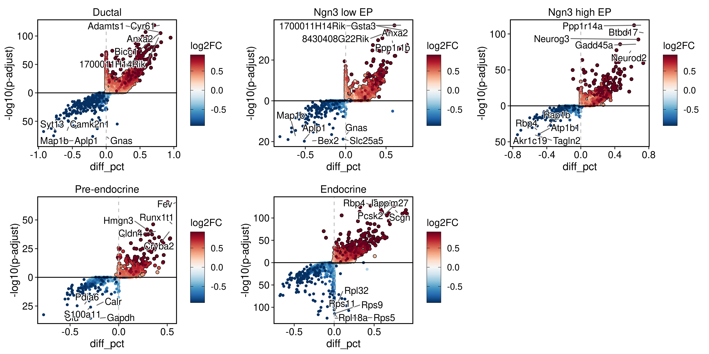

``` r
DEGs <- pancreas_sub@tools$DEtest_CellType$AllMarkers_wilcox
DEGs <- DEGs[with(DEGs, avg_log2FC > 1 & p_val_adj < 0.05), ]
pancreas_sub <- AnnotateFeatures(pancreas_sub, species = "Mus_musculus", db = c("TF", "SP"))
ht <- ExpHeatmap(
  srt = pancreas_sub, group.by = "CellType", features = DEGs$gene, feature_split = DEGs$group1,
  species = "Mus_musculus", anno_terms = TRUE, anno_keys = TRUE, anno_features = TRUE,
  feature_annotation = c("TF", "SP"), feature_palcolor = list(c("gold", "steelblue"), c("forestgreen")),
  height = 5.5, width = 5
)
print(ht$plot)
```

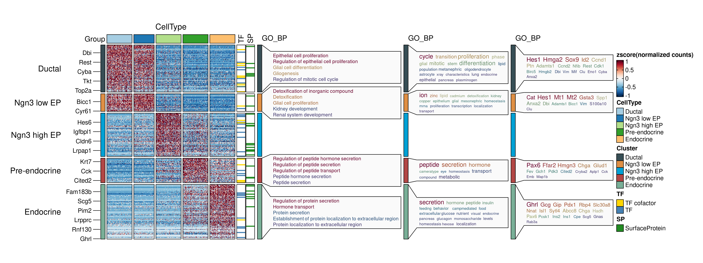

### Enrichment analysis(over-representation)

``` r
pancreas_sub <- RunEnrichment(
  srt = pancreas_sub, group_by = "CellType", db = "GO_BP", species = "Mus_musculus",
  DE_threshold = "avg_log2FC > 1 & p_val_adj < 0.05"
)
EnrichmentPlot(
  srt = pancreas_sub, group_by = "CellType", group_use = c("Ductal", "Endocrine"),
  plot_type = "bar"
)
```


``` r
EnrichmentPlot(
  srt = pancreas_sub, group_by = "CellType", group_use = c("Ductal", "Endocrine"),
  plot_type = "wordcloud"
)
```

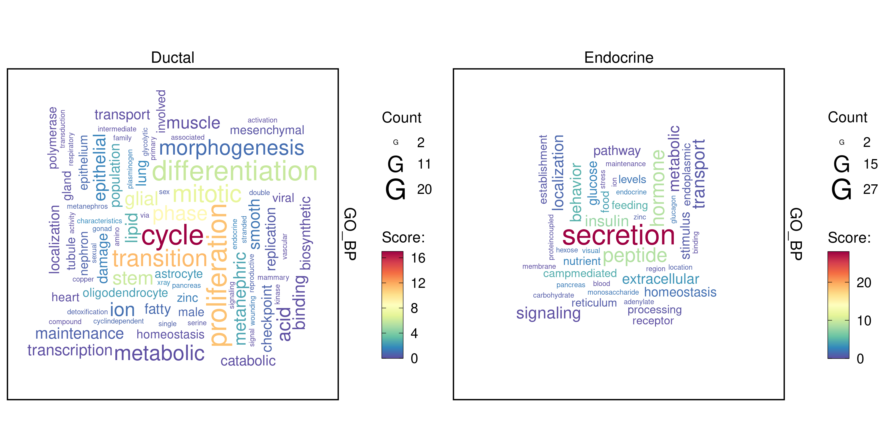

``` r
EnrichmentPlot(
  srt = pancreas_sub, group_by = "CellType", group_use = c("Ductal", "Endocrine"),
  plot_type = "wordcloud", word_type = "feature"
)
```

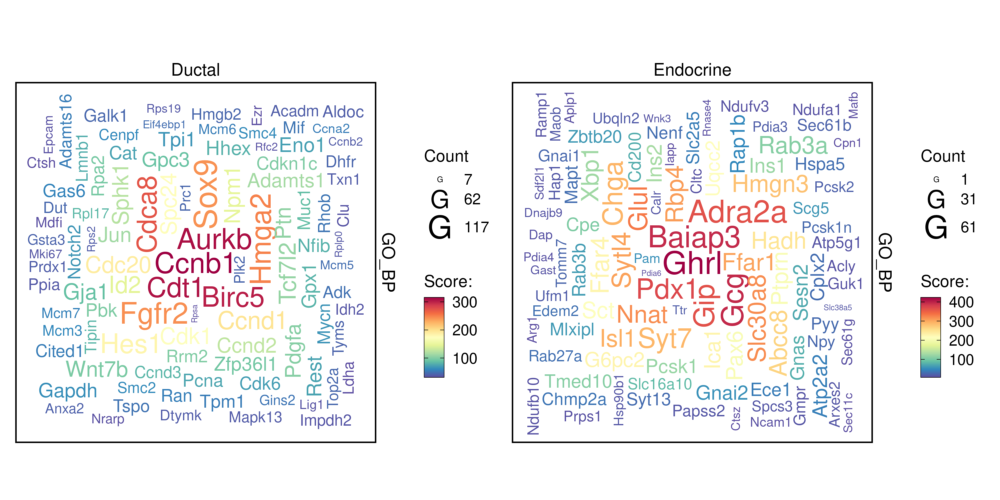

### Enrichment analysis(GSEA)

``` r
pancreas_sub <- RunGSEA(
  srt = pancreas_sub, group_by = "CellType", db = "GO_BP", species = "Mus_musculus",
  DE_threshold = "p_val_adj < 0.05"
)
GSEAPlot(srt = pancreas_sub, group_by = "CellType", group_use = "Endocrine")
```

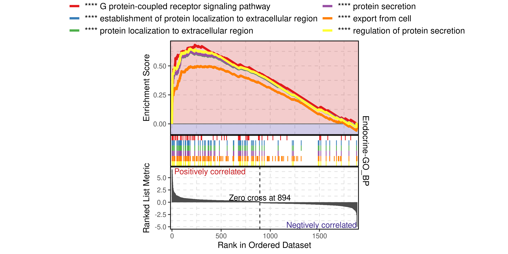

``` r
GSEAPlot(srt = pancreas_sub, group_by = "CellType", group_use = "Endocrine", geneSetID = "GO:0007186")
```

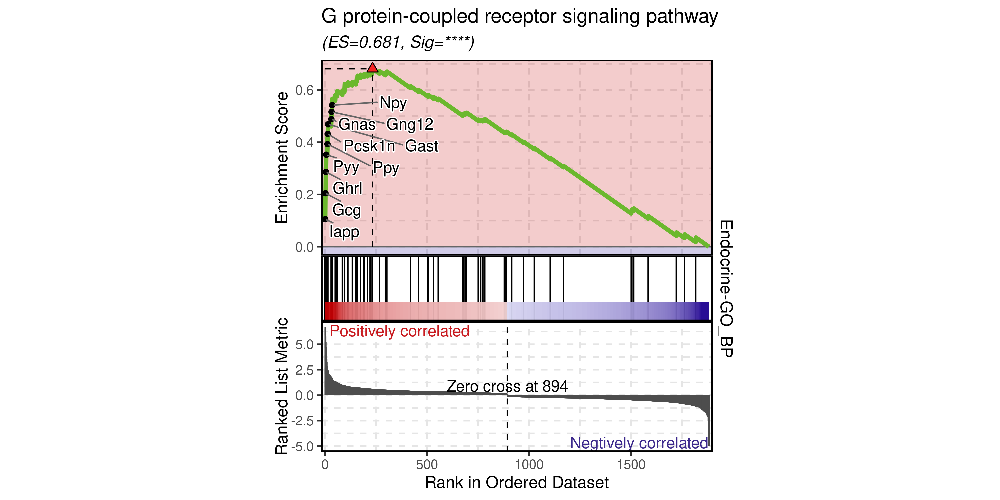

### Trajectory inference

``` r
pancreas_sub <- RunSlingshot(srt = pancreas_sub, group.by = "SubCellType", reduction = "UMAP")
```

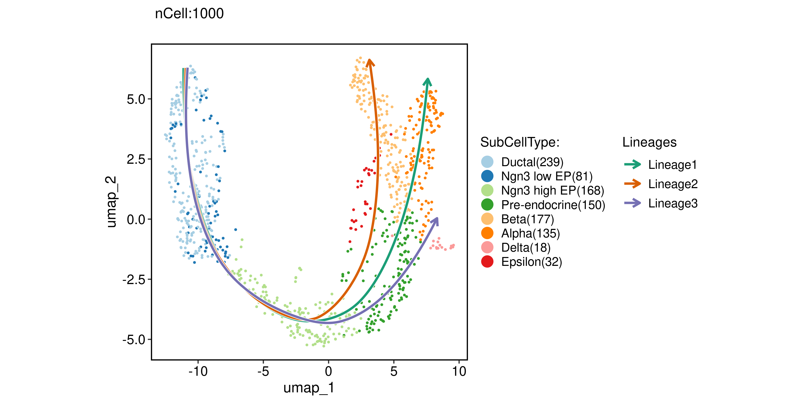

``` r
ExpDimPlot(pancreas_sub, features = paste0("Lineage", 1:3), reduction = "UMAP", theme_use = "theme_blank")
```

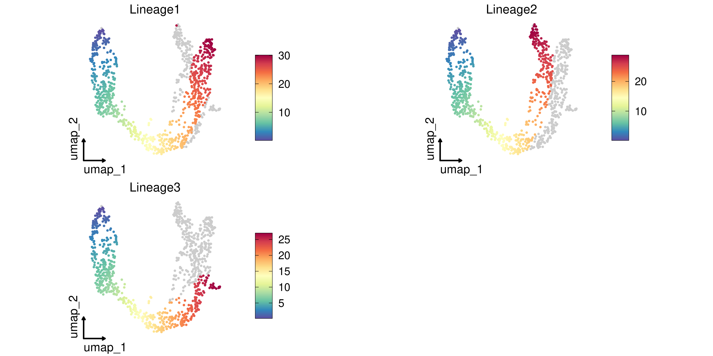

``` r
ClassDimPlot(pancreas_sub, group.by = "SubCellType", reduction = "UMAP", lineages = paste0("Lineage", 1:3), lineages_span = 0.1)
```


### Dynamic features

``` r
pancreas_sub <- RunDynamicFeatures(srt = pancreas_sub, lineages = c("Lineage1", "Lineage2"), n_candidates = 200)
ht <- DynamicHeatmap(
  srt = pancreas_sub, lineages = c("Lineage1", "Lineage2"), cell_annotation = "SubCellType",
  n_split = 5, reverse_ht = "Lineage1",
  species = "Mus_musculus", anno_terms = TRUE, anno_keys = TRUE, anno_features = TRUE,
  feature_annotation = c("TF", "SP"), feature_palcolor = list(c("gold", "steelblue"), c("forestgreen")),
  height = 5.5, width = 5
)
print(ht$plot)
```

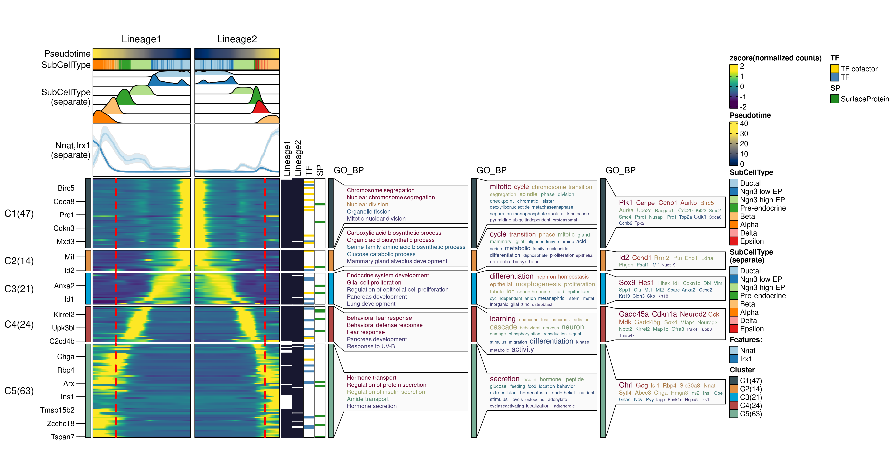

``` r
DynamicPlot(
  srt = pancreas_sub, lineages = c("Lineage1", "Lineage2"), group.by = "SubCellType",
  features = c("Plk1", "Hes1", "Neurod2", "Ghrl", "Gcg", "Ins2"),
  compare_lineages = TRUE, compare_features = FALSE
)
```

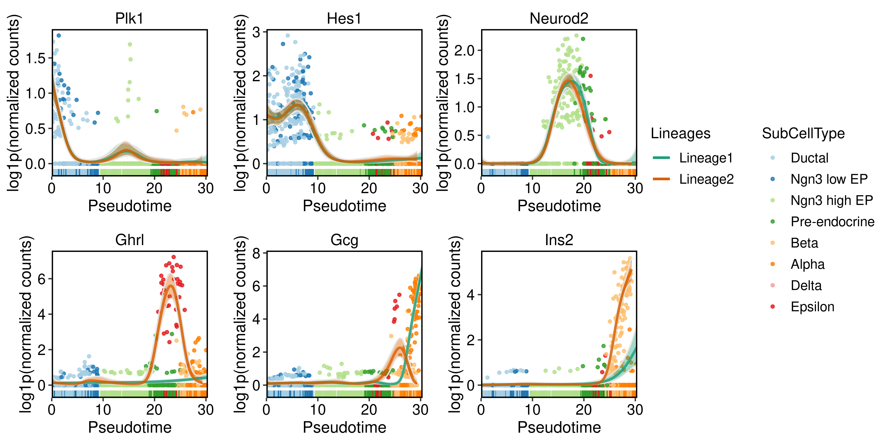

``` r
ExpStatPlot(
  srt = pancreas_sub, group.by = "SubCellType", bg.by = "CellType",
  features = c("Sox9", "Neurod2", "Isl1", "Rbp4"),
  comparisons = list(
    c("Ductal", "Ngn3 low EP"),
    c("Ngn3 high EP", "Pre-endocrine"),
    c("Alpha", "Beta")
  ),
  multiplegroup_comparisons = TRUE
)
```

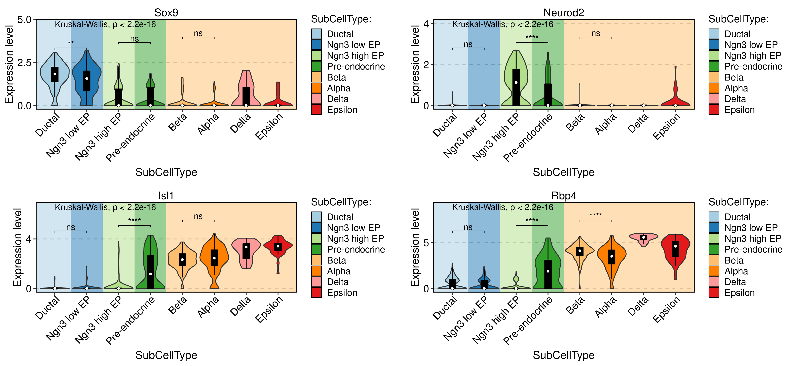

More examples of SCP can be found in the documentation of the individual
functions, such as
[Integration_SCP](https://zhanghao-njmu.github.io/SCP/reference/Integration_SCP.html),
[RunKNNMap](https://zhanghao-njmu.github.io/SCP/reference/RunKNNMap.html),
[RunMonocle3](https://zhanghao-njmu.github.io/SCP/reference/RunMonocle3.html),
[ClassDimPlot](https://zhanghao-njmu.github.io/SCP/reference/ClassDimPlot.html),
[ExpHeatmap](https://zhanghao-njmu.github.io/SCP/reference/ExpHeatmap.html),
[RunSCExplorer](https://zhanghao-njmu.github.io/SCP/reference/RunSCExplorer.html),
etc.
